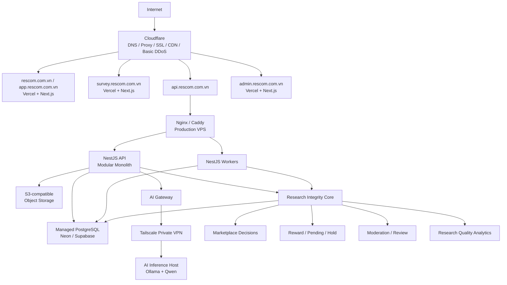
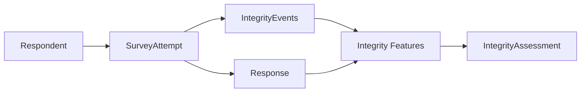
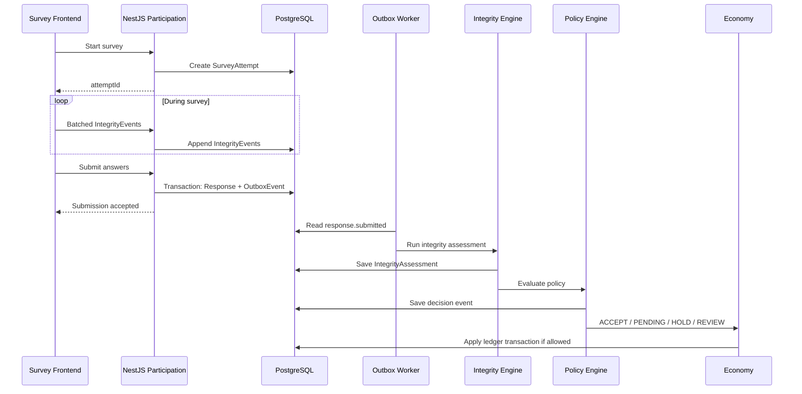
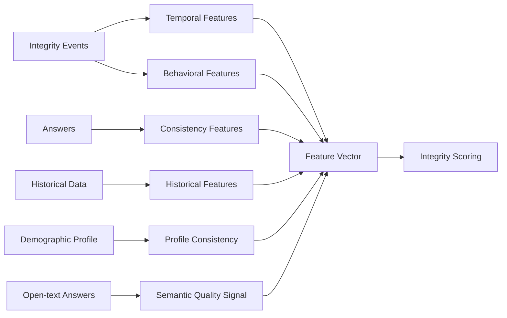
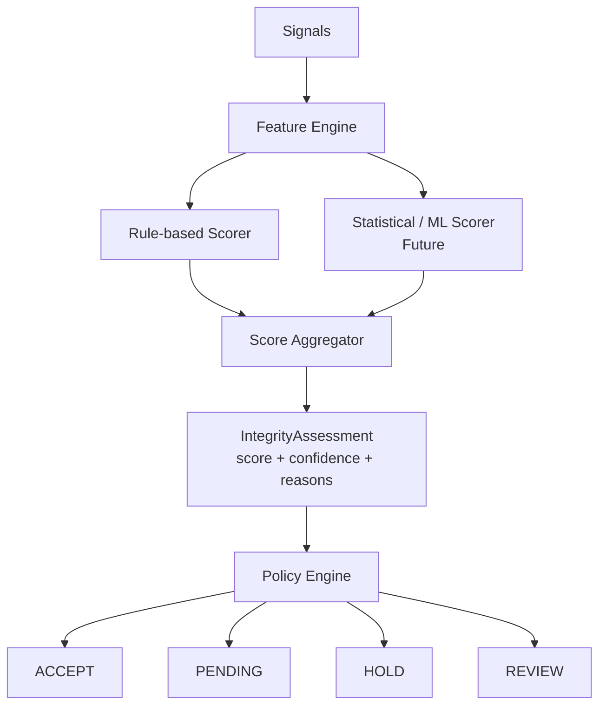
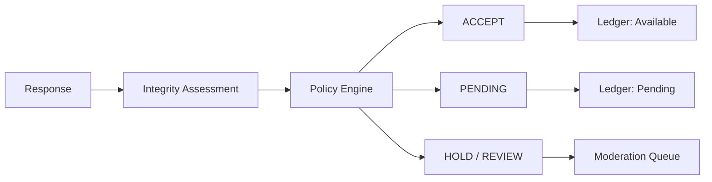
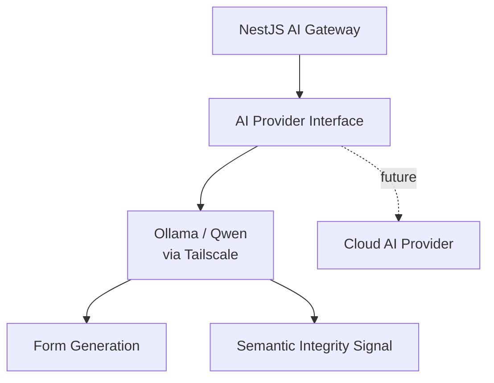
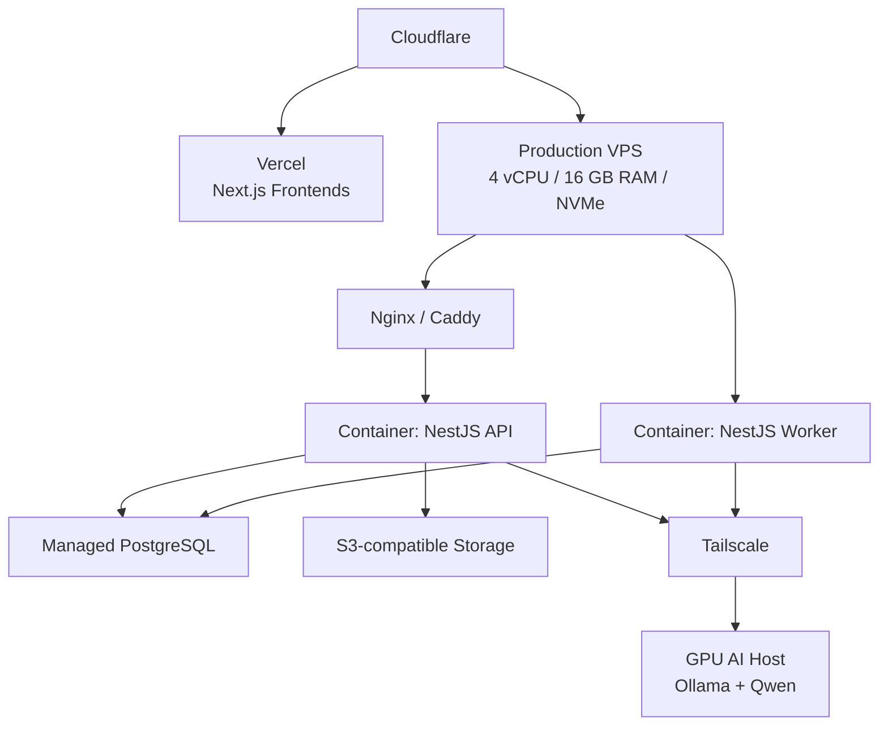
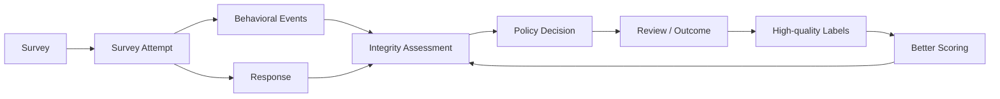

> [!WARNING]
> **Historical proposal — non-canonical.** This document is preserved for rationale only. It does not override the canonical authority chain in `_bmad-output/planning-artifacts/architecture/architecture-project-rescom-2026-08-08/ARCHITECTURE-SPINE.md`. In particular, its reduced-confidence External assessment, replacement of `FraudLog`, and independent worker-service implications are superseded. Do not use its schema examples for migration work.

# RESCOM Architecture V2 — Research Integrity Engine

# 1. Mục tiêu kiến trúc V2

> **RESCOM V2 giữ nguyên nền tảng hạ tầng production hiện tại, nhưng tái cấu trúc domain architecture để Research Integrity Engine trở thành công nghệ lõi của hệ thống.**
> 

Mục tiêu không phải biến RESCOM thành một hệ thống ML phức tạp ngay từ đầu. V2 ưu tiên ba nguyên tắc:

- **Modular Monolith trước, Microservices sau.**
- **Thu đúng dữ liệu integrity ngay từ ngày đầu.**
- **Scoring chỉ tạo bằng chứng; Policy Engine mới đưa ra quyết định nghiệp vụ.**

Research Integrity Engine phải giúp RESCOM trả lời được câu hỏi quan trọng nhất:

> **Một response đáng tin đến mức nào, vì sao, và hệ thống nên xử lý response đó như thế nào?**
> 

---

# 2. Kiến trúc tổng thể



## 2.1 Physical architecture

Production V2 vẫn gồm các hạ tầng chính:

1. Frontend Infrastructure — Vercel
2. Backend Infrastructure — NestJS trên VPS
3. Database Infrastructure — Managed PostgreSQL
4. File Storage Infrastructure — S3-compatible Object Storage
5. AI Infrastructure — AI Gateway + Ollama/Qwen qua Tailscale
6. Operations / Security — Cloudflare, reverse proxy, logging, monitoring
7. Integrity Processing — NestJS worker processes dùng cùng codebase với backend

**Integrity Engine trong V2 là logical core domain, chưa phải microservice riêng.**

---

# 3. Kiến trúc domain

RESCOM V2 chia backend thành các bounded context sau:

```
RESCOM
│
├── Identity
│   ├── User
│   ├── Authentication
│   ├── Authorization
│   ├── Session
│   └── Demographic Profile
│
├── Research
│   ├── Survey
│   ├── Form
│   ├── Form Definition JSON
│   ├── Form Version
│   └── Targeting
│
├── Participation
│   ├── Survey Attempt
│   ├── Response
│   ├── Answer
│   └── Submission Lifecycle
│
├── Integrity                     ← CORE IP
│   ├── Telemetry
│   ├── Feature Extraction
│   ├── Integrity Scoring
│   ├── Policy Engine
│   ├── Respondent Reputation
│   ├── Survey Quality
│   ├── Integrity Incidents
│   ├── Review / Adjudication
│   └── TrustGraph
│
├── Marketplace
│   ├── Eligibility
│   ├── Matching
│   └── Ranking
│
├── Economy
│   ├── Wallet
│   ├── Double-entry Ledger
│   ├── Escrow
│   └── Reward Settlement
│
├── Moderation
│   ├── Survey Moderation
│   ├── Integrity Review
│   └── Disputes
│
├── Analytics
│   ├── Research Analytics
│   ├── Integrity Analytics
│   └── Publisher Dashboard
│
├── Notifications
│
└── AI
    ├── Form Generation
    └── Semantic Integrity Signals
```

## 3.1 Quy tắc phụ thuộc giữa các module

- `Participation` tạo ra Attempt, Response và domain events.
- `Integrity` đọc dữ liệu Participation nhưng **không sở hữu response**.
- `Integrity` tạo Assessment, Reputation và Incident.
- `Economy` không tự đánh giá chất lượng response; nó nhận quyết định từ `Integrity Policy`.
- `Marketplace` sử dụng reputation/integrity signal nhưng không được sửa integrity state.
- `Moderation` có thể tạo review outcome; outcome này trở thành label cho Integrity Engine.
- `AI` chỉ cung cấp signal hoặc draft; AI không được trực tiếp reject user, xóa response hoặc thay đổi ledger.

---

# 4. NestJS module boundaries

```
apps/backend/src/
│
├── modules/
│   ├── identity/
│   │   ├── identity.module.ts
│   │   ├── domain/
│   │   ├── application/
│   │   └── infrastructure/
│   │
│   ├── research/
│   │   ├── research.module.ts
│   │   ├── surveys/
│   │   ├── forms/
│   │   ├── targeting/
│   │   └── versioning/
│   │
│   ├── participation/
│   │   ├── participation.module.ts
│   │   ├── attempts/
│   │   ├── responses/
│   │   └── submissions/
│   │
│   ├── integrity/
│   │   ├── integrity.module.ts
│   │   ├── telemetry/
│   │   ├── features/
│   │   ├── scoring/
│   │   ├── policies/
│   │   ├── reputation/
│   │   ├── survey-quality/
│   │   ├── incidents/
│   │   ├── reviews/
│   │   └── trust-graph/
│   │
│   ├── marketplace/
│   ├── economy/
│   │   ├── wallet/
│   │   ├── ledger/
│   │   └── escrow/
│   ├── moderation/
│   ├── analytics/
│   ├── notifications/
│   └── ai/
│
├── infrastructure/
│   ├── database/
│   ├── events/
│   │   └── outbox/
│   ├── storage/
│   ├── ai/
│   └── queue/
│
├── common/
│   ├── guards/
│   ├── pipes/
│   ├── interceptors/
│   ├── filters/
│   └── decorators/
│
├── workers/
│   ├── outbox.worker.ts
│   ├── integrity.worker.ts
│   ├── reputation.worker.ts
│   ├── pending-balance.worker.ts
│   ├── refund.worker.ts
│   └── notification.worker.ts
│
└── main.ts
```

## 4.1 NestJS conventions

- `Module` = bounded context / feature boundary.
- `Controller` chỉ xử lý transport HTTP.
- `Application Service` điều phối use case.
- `Domain Service` chứa business logic không phụ thuộc framework.
- `Repository` nằm sau interface, implementation dùng Prisma.
- `Guard` xử lý auth/RBAC.
- `Pipe` xử lý input validation/normalization.
- `Interceptor` dùng cho logging/tracing/response envelope khi cần.
- `Exception Filter` chuẩn hóa lỗi.
- Background worker dùng cùng module/service để tránh duplicate logic.

Không dùng CQRS bắt buộc trong V2. Chỉ cân nhắc `@nestjs/cqrs` khi số lượng command/query và state transition thực sự đủ phức tạp.

---

# 5. Domain object trung tâm: Form Definition JSON

Form Definition JSON tiếp tục là domain object chính của Form System.

```json
{
  "schemaVersion": 2,
  "metadata": {
    "title": "Khảo sát trải nghiệm học tập",
    "description": "..."
  },
  "settings": {
    "showProgressBar": true,
    "shuffleQuestions": false
  },
  "sections": [
    {
      "id": "section_01",
      "title": "Thông tin chung",
      "order": 0,
      "questions": [
        {
          "id": "question_01",
          "type": "single_choice",
          "label": "Bạn đang học năm mấy?",
          "required": true,
          "config": {
            "options": [
              { "id": "opt_1", "label": "Năm 1" },
              { "id": "opt_2", "label": "Năm 2" }
            ]
          }
        }
      ]
    }
  ]
}
```

Published Form Version là immutable. Mỗi Attempt và Response phải tham chiếu chính xác `formVersionId`.

Integrity telemetry cũng phải gắn với `formVersionId` và `questionId`, nhờ đó dữ liệu integrity vẫn có thể tái hiện chính xác theo từng version của khảo sát.

---

# 6. SurveyAttempt — object trung tâm của Integrity Engine

`Response` chỉ cho biết kết quả cuối cùng. `SurveyAttempt` cho biết **quá trình tạo ra response**.



Một Attempt được tạo khi respondent thực sự bắt đầu phiên làm survey.

Attempt phải lưu tối thiểu:

```
id
respondentId
surveyId
formVersionId
status
startedAt
submittedAt
clientContext
createdAt
```

Không tạo Attempt mới mỗi lần reload nếu có thể khôi phục phiên hợp lệ. Quy tắc lifecycle phải đảm bảo một người dùng không thể tạo hàng loạt Attempt nhằm né integrity tracking.

---

# 7. Data flow chính

## 7.1 Internal Form flow



## 7.2 External Form flow

External forms cung cấp integrity signal ít hơn internal forms.

```
RESCOM start session
      ↓
SurveyAttempt
      ↓
redirect to external form
      ↓
return / completion code
      ↓
Time Barrier + Code Verification + History
      ↓
IntegrityAssessment with reduced confidence
```

Vì vậy external form là **compatibility/acquisition feature**, trong khi Internal RESCOM Form là **strategic data platform** của Research Integrity Engine.

---

# 8. Event taxonomy

Integrity events phải có version, immutable và append-only.

## 8.1 Session events

```
SURVEY_ATTEMPT_STARTED
SURVEY_ATTEMPT_RESUMED
SURVEY_ATTEMPT_ABANDONED
SURVEY_SUBMITTED
```

## 8.2 Question interaction events

```
QUESTION_SHOWN
QUESTION_FOCUSED
QUESTION_BLURRED
ANSWER_SELECTED
ANSWER_ENTERED
ANSWER_CHANGED
ANSWER_CLEARED
QUESTION_SKIPPED
QUESTION_RETURNED
```

## 8.3 Visibility / attention events

```
PAGE_HIDDEN
PAGE_VISIBLE
ATTENTION_CHECK_PASSED
ATTENTION_CHECK_FAILED
```

## 8.4 Integrity / system events

```
TIME_BARRIER_TRIGGERED
RATE_LIMIT_TRIGGERED
DEMOGRAPHIC_CONFLICT_DETECTED
DUPLICATE_PATTERN_DETECTED
SEMANTIC_QUALITY_EVALUATED
INTEGRITY_ASSESSMENT_CREATED
INTEGRITY_POLICY_DECIDED
INTEGRITY_REVIEW_COMPLETED
```

## 8.5 Economy integration events

```
REWARD_PENDING
REWARD_RELEASED
REWARD_HELD
REWARD_REJECTED
ESCROW_RELEASED
ESCROW_REFUNDED
```

## 8.6 Event envelope chuẩn

```json
{
  "eventId": "evt_...",
  "eventType": "ANSWER_CHANGED",
  "eventVersion": 1,
  "occurredAt": "2026-08-16T09:00:00.000Z",
  "attemptId": "att_...",
  "respondentId": "usr_...",
  "formVersionId": "fv_...",
  "questionId": "q_...",
  "sequence": 31,
  "metadata": {
    "dwellTimeMs": 8200
  }
}
```

Không đưa sensitive raw data vào `metadata` nếu không cần thiết.

---

# 9. Telemetry privacy rules

Research Integrity Engine không được trở thành một hệ thống surveillance.

Thu thập:

- thời gian tương tác theo question
- answer revision count/rate
- skip/return behavior
- visibility transitions ở mức cần thiết
- attention-check outcomes
- session lifecycle
- response timing

Không thu thập mặc định:

- raw keystroke stream
- clipboard content
- mouse coordinates từng pixel
- cross-site fingerprinting
- nội dung ngoài survey
- dữ liệu thiết bị không phục vụ rõ ràng cho fraud/integrity use case

Mọi telemetry mới phải trả lời được ba câu hỏi:

1. Nó tạo ra feature integrity nào?
2. Nó có thực sự cải thiện assessment hay không?
3. Có cách ít xâm phạm quyền riêng tư hơn không?

---

# 10. Feature extraction pipeline

Raw event không được đưa trực tiếp vào decision logic.



## 10.1 Nhóm feature ban đầu

### Temporal

```
completion_time_ms
completion_time_ratio
mean_question_dwell_ms
median_question_dwell_ms
fast_answer_ratio
```

### Behavioral

```
answer_revision_rate
skip_return_rate
focus_loss_count
question_revisit_rate
abandonment_history
```

### Attention

```
attention_check_pass_rate
instruction_check_score
```

### Consistency

```
cross_question_consistency
profile_answer_consistency
logical_conflict_count
```

### Historical

```
historical_acceptance_rate
historical_review_rate
historical_dispute_rate
historical_completion_baseline
respondent_reputation
```

### Semantic

```
open_text_relevance
low_effort_text_probability
semantic_consistency
```

Semantic features có thể dùng Qwen hoặc provider khác, nhưng chỉ là signal bổ sung.

---

# 11. Scoring pipeline

Scoring Engine và Policy Engine là hai thành phần độc lập.



## 11.1 V2.0 — Rule-based first

Ban đầu không cần ML model.

Integrity Scorer sử dụng:

- minimum completion constraints
- attention-check outcomes
- obvious answer conflicts
- duplicate constraints
- historical reputation nếu có
- basic temporal anomaly
- external-form confidence penalty

Không hard-code business decision trong scorer.

## 11.2 IntegrityAssessment

Assessment lưu:

```
score
confidence
riskLevel
componentScores
reasonCodes
featureSnapshotVersion
scoringVersion
policyVersionAtDecision
createdAt
```

Assessment là immutable. Re-score tạo record mới thay vì overwrite record cũ.

## 11.3 Policy Engine

Ví dụ policy có thể quy định:

```
HIGH_CONFIDENCE     → ACCEPT
MEDIUM_CONFIDENCE   → PENDING
HIGH_RISK           → HOLD
AMBIGUOUS           → REVIEW
```

Ngưỡng cụ thể phải nằm trong cấu hình/versioned policy, không ghi cố định vào architecture.

---

# 12. Respondent Reputation

Reputation không phải tổng điểm gamification.

`RespondentReputation` phản ánh mức độ đáng tin cậy theo lịch sử và phải tách khỏi reward/streak/tier.

Có thể bao gồm:

```
integrityScoreRolling
acceptedResponses
reviewedResponses
confirmedIncidents
disputeOutcomeRate
attentionPerformance
baselineCompletionProfile
confidence
lastCalculatedAt
version
```

Reputation là input cho Integrity Scoring và Marketplace Ranking, nhưng không được dùng làm lý do duy nhất để reject response.

---

# 13. Survey Quality Profile

Integrity Engine không chỉ đánh giá respondent. Nó cũng đánh giá survey.

```
SurveyQualityProfile
├── expectedCompletionTime
├── completionTimeDistribution
├── abandonmentRate
├── attentionFailureRate
├── negativeFeedbackRate
├── confusingQuestionSignals
└── integrityRiskDistribution
```

Mục tiêu là tránh trường hợp respondent bị đánh giá thấp chỉ vì survey được thiết kế kém.

---

# 14. IntegrityIncident thay cho FraudLog thuần túy

`FraudLog` hiện tại được mở rộng thành abstraction `IntegrityIncident`.

Ví dụ incident type:

```
SPEED_ANOMALY
ATTENTION_FAILURE
DEMOGRAPHIC_CONFLICT
ANSWER_INCONSISTENCY
DUPLICATE_PATTERN
ACCOUNT_BEHAVIOR_ANOMALY
AUTOMATION_SUSPECTED
NETWORK_ANOMALY
```

Incident phải append-only ở phần evidence history.

Một signal bất thường **không đồng nghĩa fraud**.

Lifecycle:

```
DETECTED
   ↓
OPEN
   ↓
REVIEWED
   ├── DISMISSED
   ├── CONFIRMED_LOW_QUALITY
   └── CONFIRMED_FRAUD
```

Kết quả human review là training label có giá trị cao cho model tương lai.

---

# 15. TrustGraph

TrustGraph trong V2 là **logical graph**, chưa yêu cầu Graph Database.

Các node chính:

```
Respondent
Survey
Publisher
Response
IntegrityIncident
Review
```

Các edge ví dụ:

```
Respondent ──COMPLETED──> Survey
Publisher ──PUBLISHED──> Survey
Response ──FLAGGED_BY──> IntegrityIncident
IntegrityIncident ──REVIEWED_AS──> ReviewOutcome
Respondent ──DISPUTED_BY──> Publisher
```

V2 lưu quan hệ bằng PostgreSQL. Chỉ cân nhắc Neo4j/TigerGraph khi scale và graph traversal/community detection trở thành nhu cầu thật.

---

# 16. Prisma entities V2

Các model dưới đây là kiến trúc đề xuất; field chi tiết có thể điều chỉnh khi cập nhật schema thực tế.

## 16.1 SurveyAttempt

```
model SurveyAttempt {
  id            String   @id @default(cuid())
  respondentId  String
  surveyId      String
  formVersionId String?
  status        AttemptStatus @default(IN_PROGRESS)
  startedAt     DateTime @default(now())
  submittedAt   DateTime?
  clientContext Json?
  createdAt     DateTime @default(now())
  updatedAt     DateTime @updatedAt

  integrityEvents      IntegrityEvent[]
  integrityAssessments IntegrityAssessment[]
}
```

## 16.2 IntegrityEvent

```
model IntegrityEvent {
  id            String   @id @default(cuid())
  attemptId     String
  respondentId  String
  formVersionId String?
  questionId    String?
  eventType     IntegrityEventType
  eventVersion  Int      @default(1)
  sequence      Int
  occurredAt    DateTime
  metadata      Json?
  createdAt     DateTime @default(now())

  attempt SurveyAttempt @relation(fields: [attemptId], references: [id])

  @@unique([attemptId, sequence])
  @@index([respondentId, occurredAt])
  @@index([attemptId, eventType])
}
```

## 16.3 IntegrityAssessment

```
model IntegrityAssessment {
  id              String   @id @default(cuid())
  attemptId       String
  responseId      String?
  respondentId    String
  score           Decimal
  confidence      Decimal
  riskLevel       IntegrityRiskLevel
  componentScores Json
  reasonCodes     Json
  featureVersion  String
  scoringVersion  String
  policyVersion   String?
  createdAt       DateTime @default(now())

  attempt SurveyAttempt @relation(fields: [attemptId], references: [id])

  @@index([respondentId, createdAt])
  @@index([responseId])
}
```

## 16.4 RespondentReputation

```
model RespondentReputation {
  id                    String   @id @default(cuid())
  respondentId          String   @unique
  integrityScoreRolling Decimal
  confidence            Decimal
  acceptedResponses     Int      @default(0)
  reviewedResponses     Int      @default(0)
  confirmedIncidents    Int      @default(0)
  metrics               Json
  version               Int      @default(1)
  calculatedAt          DateTime
  updatedAt             DateTime @updatedAt
}
```

## 16.5 IntegrityIncident

```
model IntegrityIncident {
  id           String   @id @default(cuid())
  attemptId    String?
  responseId   String?
  respondentId String
  type         IntegrityIncidentType
  status       IntegrityIncidentStatus @default(OPEN)
  severity     IntegritySeverity
  evidence     Json
  detectedAt   DateTime @default(now())
  reviewedAt   DateTime?
  resolution   IntegrityResolution?
  createdAt    DateTime @default(now())
}
```

## 16.6 IntegrityReview

```
model IntegrityReview {
  id           String   @id @default(cuid())
  incidentId   String
  reviewerId   String
  decision     IntegrityResolution
  reason       String?
  evidence     Json?
  createdAt    DateTime @default(now())
}
```

## 16.7 ScoringPolicy

```
model ScoringPolicy {
  id          String   @id @default(cuid())
  name        String
  version     Int
  status      PolicyStatus
  definition  Json
  activatedAt DateTime?
  createdAt   DateTime @default(now())

  @@unique([name, version])
}
```

## 16.8 IntegrityModelVersion

Chỉ cần bắt buộc khi bắt đầu dùng statistical/ML model.

```
model IntegrityModelVersion {
  id            String   @id @default(cuid())
  name          String
  version       String
  modelType     String
  featureVersion String
  metadata      Json
  activatedAt   DateTime?
  retiredAt     DateTime?
  createdAt     DateTime @default(now())

  @@unique([name, version])
}
```

## 16.9 OutboxEvent

```
model OutboxEvent {
  id          String   @id @default(cuid())
  eventType   String
  aggregateId String
  payload     Json
  status      OutboxStatus @default(PENDING)
  attempts    Int      @default(0)
  availableAt DateTime @default(now())
  processedAt DateTime?
  createdAt   DateTime @default(now())

  @@index([status, availableAt])
}
```

---

# 17. Transactional Outbox

Không publish domain event trực tiếp sau khi commit business record theo cách dễ mất message.

Sai:

```
save Response
    ↓
publish event
```

Nếu DB thành công nhưng publish thất bại thì Integrity Engine mất submission.

Đúng:

```
BEGIN TRANSACTION

INSERT Response
INSERT OutboxEvent(response.submitted)

COMMIT
```

Sau đó:

```
Outbox Worker
    ↓
read pending events
    ↓
invoke application handler
    ↓
mark processed
```

V2 có thể dùng PostgreSQL outbox + NestJS worker. Chưa cần Kafka.

---

# 18. Realtime Integrity và Deep Integrity

Integrity pipeline chia hai tầng.

## Tier 1 — Realtime Guard

Chạy trong submission path hoặc ngay sau submission:

```
required answer validation
one completion constraint
time barrier
rate limit
attention checks
obvious duplicate checks
basic logical consistency
```

Mục tiêu: nhanh và deterministic.

## Tier 2 — Deep Integrity Assessment

Chạy asynchronous:

```
historical baseline
cross-survey consistency
respondent reputation
advanced temporal anomaly
semantic quality
network / graph signals
future ML scoring
```

Flow:

```
SUBMIT
  ↓
Realtime Guard
  ↓
provisional state
  ↓
Async Integrity Worker
  ↓
final assessment / policy decision
```

---

# 19. Economy integration

Economy Module không tự tính integrity.



Double-entry Ledger vẫn immutable và là source of truth cho point movement.

Integrity chỉ tạo quyết định nghiệp vụ; Economy chịu trách nhiệm transaction/ledger consistency.

---

# 20. Marketplace integration

Marketplace Ranking V2 có thể dùng các thành phần:

```
Target Match
Completion Probability
Expected Integrity
Respondent Reputation
Reward Utility
Deadline Priority
Survey Quality
```

Không cố định công thức ở architecture.

Nguyên tắc:

- demographic match cao nhưng reliability rất thấp không nhất thiết được ưu tiên
- reputation không được tạo vòng lặp khóa người dùng mới khỏi hệ thống
- New User cần exploration quota / cold-start strategy
- Marketplace không được đọc private telemetry thô; chỉ sử dụng aggregate feature/reputation được phép

---

# 21. AI architecture V2

AI vẫn nằm ngoài core business transaction.



AI use cases:

### Generative AI

```
Prompt
↓
Qwen
↓
Structured Form JSON
↓
Zod validation
↓
Business validation
↓
Normalize IDs
↓
Draft
```

### Integrity AI

```
Open-text response
↓
AI semantic evaluator
↓
semanticQualitySignal
↓
Integrity Feature Engine
```

AI **không trực tiếp**:

- ban user
- reject response
- mint/burn point
- update ledger
- quyết định fraud

---

# 22. Deployment architecture



Có thể build chung một Docker image:

```
rescom-backend:latest
```

và chạy hai command/process khác nhau:

```
API process
Worker process
```

Nhờ đó code reuse tối đa trong giai đoạn modular monolith.

---

# 23. Database strategy

## Local

```
Docker Compose
├── NestJS API
├── NestJS Worker
└── PostgreSQL
```

## Production

```
NestJS API / Worker
       │
       ▼
Connection Pool
       │
       ▼
Managed PostgreSQL
```

Database là critical infrastructure vì chứa:

- user identity
- immutable form versions
- response lifecycle
- survey attempts
- integrity events
- integrity assessments
- reputation
- point ledger
- escrow
- moderation evidence

---

# 24. Observability

Mọi request và background job quan trọng cần có correlation identifiers.

Nên chuẩn hóa:

```
requestId
attemptId
responseId
outboxEventId
assessmentId
```

Metrics quan trọng:

```
API latency
submission success rate
outbox backlog
integrity processing latency
assessment failure rate
review queue size
pending reward age
AI dependency availability
```

Log không được chứa password, JWT, raw sensitive demographics hoặc full survey answer nếu không thật sự cần thiết.

---

# 25. Security boundaries

- Backend không tin frontend đối với thời gian, reward, completion state hoặc point calculation.
- AI inference host không public Internet; chỉ backend/worker truy cập qua Tailscale.
- Point Ledger chỉ thay đổi thông qua Economy application service.
- Integrity event là append-only.
- Assessment được versioned, không overwrite lịch sử.
- Published FormVersion immutable.
- Admin action phải audit.
- File upload dùng presigned URL và kiểm soát MIME/size/type ở server-side policy.
- Idempotency key cho critical write operations.

---

# 26. Không đưa vào V2 baseline

Các công nghệ dưới đây **không được coi là dependency bắt buộc trong V2**:

```
Kafka / Redpanda
Kubernetes
Neo4j
ClickHouse
Feature Store
MLflow
Airflow
separate ML microservices
data lake
```

Chỉ bổ sung khi có nhu cầu scale thực tế.

---

# 27. Evolution roadmap

## V2.0 — Integrity Data Foundation

```
NestJS Modular Monolith
SurveyAttempt
IntegrityEvent
Transactional Outbox
Realtime Guard
Rule-based Scoring
IntegrityAssessment
IntegrityIncident
```

Mục tiêu: **thu đúng dữ liệu ngay từ ngày đầu**.

## V2.1 — Reputation & Survey Baselines

```
RespondentReputation
SurveyQualityProfile
historical baselines
publisher analytics
review labels
```

## V2.2 — Statistical / ML Integrity

```
feature versioning
model versioning
anomaly detection
score calibration
semantic quality signal
supervised learning from review labels
```

## V2.3 — TrustGraph

```
respondent ↔ survey
publisher ↔ survey
response ↔ incident
incident ↔ review outcome
network features
```

Vẫn có thể chạy trên PostgreSQL nếu scale cho phép.

## V3 — Integrity Platform

Khi khối lượng dữ liệu và traffic đủ lớn mới cân nhắc:

```
Event Streaming
Independent Integrity Service
Dedicated Model Serving
Analytics Database
Graph Infrastructure
External Integrity API
```

Khi đó Research Integrity Engine có thể trở thành platform độc lập được cả RESCOM Marketplace và sản phẩm B2B bên ngoài sử dụng.

---

# 28. Architectural principles cần giữ cố định

1. **Research Integrity Engine là Core Domain, không phải một endpoint anti-fraud.**
2. **SurveyAttempt là object trung tâm của integrity data.**
3. **Raw telemetry → Features → Assessment → Policy → Business Decision.**
4. **Score và Decision phải tách nhau.**
5. **Integrity signal không đồng nghĩa Fraud.**
6. **AI chỉ là provider/signal, không phải authority.**
7. **Immutable/versioned data ở các boundary quan trọng.**
8. **Internal Form là strategic data platform.**
9. **Privacy-preserving telemetry mặc định.**
10. **Modular Monolith trước; chỉ tách service khi scale yêu cầu.**
11. **PostgreSQL là source of truth trong V2.**
12. **Data moat quan trọng hơn complexity của model.**

---

# 29. Core data flywheel



Đây là moat dài hạn của RESCOM:

> **Đối thủ có thể sao chép UI, stack hoặc thuật toán, nhưng không thể dễ dàng sao chép lịch sử SurveyAttempt + Behavioral Events + Responses + Assessment + Review Outcome + Reputation được tích lũy qua thời gian.**
> 

---

# 30. Trạng thái kiến trúc được chốt cho V2

**Frontend:** Next.js + TypeScript trên Vercel  

**Backend:** NestJS Modular Monolith  

**ORM:** Prisma  

**Database:** PostgreSQL  

**Integrity processing:** NestJS Workers  

**Async reliability:** Transactional Outbox  

**Object Storage:** S3-compatible  

**AI:** AI Provider Interface → Ollama/Qwen qua Tailscale  

**Core Technology:** Research Integrity Engine  

**Strategic Data Object:** SurveyAttempt + IntegrityEvent + IntegrityAssessment  

**Future moat:** Respondent Reputation + Survey Quality + TrustGraph + proprietary integrity dataset
