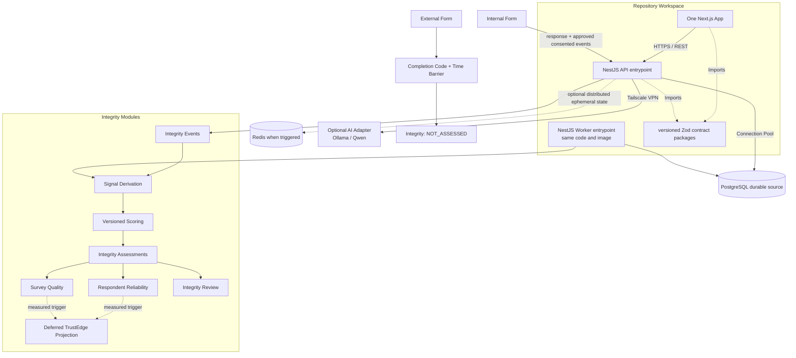

# Architecture Spine — RESCOM System Architecture

## Canonical Authority

When artifacts differ, apply this order:

1. `SPEC.md`
2. Final PRD plus approved Addendum
3. This Architecture Spine
4. `solution-design.md`
5. `epics.md`
6. Repository reality as brownfield evidence and structural seed

The two documents titled `RESCOM Architecture V2 — Research Integrity Engine` are **superseded, non-canonical historical proposals**. They may explain rationale but cannot override this chain. The current Prisma schema is a brownfield draft with no migration history in the repository; live database state is **INSUFFICIENT EVIDENCE**. It is evidence of current structure, not approval to violate this spine.

## Design Paradigm

**Pragmatic Clean Architecture + Modular Monolith**

RESCOM starts as one repository workspace, one Next.js application, and one NestJS backend codebase. The backend is divided into owned bounded contexts and uses one PostgreSQL source of truth. Production runs API and worker entrypoints from the same build artifact; this process split does not create microservices. Dependency inversion is required at load-bearing domain and external seams, while simple CRUD may remain feature-local when it preserves module ownership and inward dependency direction.

## Invariants & Rules



### AD-1 — Immutable Double-Entry Ledger [ADOPTED]
- **Binds:** Economy, every Point-producing or Point-consuming workflow, Wallet projections, financial audit.
- **Prevents:** Unbalanced mint/loss, direct balance mutation, duplicated commands, mutable financial history, and incompatible transfer representations.
- **Rule:** Economy owns `LedgerAccount`, `LedgerJournal` (transaction header), `LedgerEntry`, and a transactionally maintained but rebuildable `LedgerBalance` projection. One journal represents one business command and has a globally unique command/idempotency reference. It posts at least two immutable entries in one PostgreSQL transaction; for every `(journalId, unit)`, the signed entry sum must equal zero before posting. Account classes define unit, normal balance, and overdraft policy: user Available, Pending, Frozen, Escrow, and Integrity Hold accounts can never fall below zero; only explicitly configured system issuance/sink/clearing accounts may carry the opposite balance. Posting locks all affected balance rows in ascending account-ID order, checks sufficiency, appends journal/entries, and updates the projection in the same transaction. Runtime roles cannot update/delete posted journals or entries. A correction journal has a unique `reversesJournalId`, exactly negates that original journal's entries, and makes each journal reversible at most once; if a reversal itself must be corrected, it is the original of one later linked reversal, forming a non-branching chain. Corrected business intent posts as a new journal. Balances remain derivable from entries, which are the financial authority.

### AD-2 — Centralized Form Schema (Shared Package) [ADOPTED]
- **Binds:** Form Builder, Renderer, backend API boundaries, telemetry envelopes, AI Adapter.
- **Prevents:** Frontend/backend/event payload drift and deployment of producers that consumers cannot parse.
- **Rule:** One npm workspace exposes versioned Zod contracts from `packages/schemas` for Form Definition, API envelopes, and Integrity telemetry/events. Frontend and backend import these definitions; TypeScript types are inferred/generated from them rather than maintained independently. Schema changes declare a schema version, compatibility window, and contract tests across current producers/consumers. AI output is untrusted and must pass the backend-owned schema before Research persists a draft. Turborepo is not required by this invariant.

### AD-3 — Optional AI Dependency [ADOPTED]
- **Binds:** AI Module, Survey Creation Flow
- **Prevents:** The core system (login, survey feed, responses, points) going down when the gaming laptop/AI server is offline.
- **Rule:** The AI Gateway must be an optional dependency. If the Ollama server is unreachable or times out, the backend must gracefully fail the AI generation request, and the frontend Form Builder must continue to function normally.

### AD-4 — Secure AI Communication [ADOPTED]
- **Binds:** AI Integration, Infrastructure
- **Prevents:** Public exposure of the local GPU server.
- **Rule:** The AI server must never expose port 11434 to the internet. Communication between the VPS Backend and the AI Laptop happens exclusively over private Tailscale reachability with a least-privilege Grant permitting only the backend identity to the required AI port. Deployment validation must prove unauthorized tailnet identities and public paths are denied. The backend AI Adapter is the only authorized application client.

### AD-5 — One Backend Artifact, API and Worker Entrypoints [ADOPTED]
- **Binds:** Outbox processing, auto-refund, pending expiry, Integrity processing, notifications, deployment topology.
- **Prevents:** Conflicting in-API and separate-service implementations, request latency contention, duplicated domain logic, and accidental microservice boundaries.
- **Rule:** RESCOM has one NestJS backend codebase and one build artifact/image. Production runs an API entrypoint and a worker entrypoint as separate processes; the initial worker may have one replica. Local or explicitly small deployments may co-locate worker execution inside the API process only through configuration that guarantees one logical scheduler owner. Both entrypoints call the same application/domain services and use PostgreSQL durable claims. This is a process topology inside one modular monolith, not microservices.

### AD-6 — Redis Is Optional Ephemeral Infrastructure [ADOPTED]
- **Binds:** Cache, distributed rate limiting, ephemeral coordination, session lookup acceleration.
- **Prevents:** Redis becoming a second durable source of truth, blocking the first vertical slice, or causing silent security bypass during outage.
- **Rule:** PostgreSQL remains authoritative for Attempt start/time barriers, session revocation, Outbox claims, Ledger, and all durable workflows. Redis is introduced when multiple replicas or a measured shared-ephemeral-state requirement exists and may store caches, distributed rate-limit counters, or disposable coordination state only. Each deployment declares one abuse-control profile. `REDIS_DISABLED_SINGLE_REPLICA` is valid only for one API replica and uses PostgreSQL durable attempt/counter controls plus conservative per-process request limits; startup rejects this profile with multiple replicas. `REDIS_SHARED` uses Redis for shared request counters while PostgreSQL still owns durable abuse state. If configured Redis is unexpectedly unavailable, guest submission and completion-code mutation fail closed, sessions/cache fall back to PostgreSQL, and authenticated low-risk reads may use conservative per-process limits with an alert. Redis recovery must not require domain-state reconstruction from Redis.

### AD-7 — The Dependency Rule (Clean Architecture) [ADOPTED]
- **Binds:** Backend dependency direction and all invariant-bearing/external seams.
- **Prevents:** Business invariants depending on NestJS, Prisma, transport, or vendor APIs while avoiding architecture ceremony for trivial CRUD.
- **Rule:** Domain policy and application orchestration cannot import NestJS, Prisma, HTTP, storage, email, or AI implementations. Ports/adapters are mandatory at Ledger, Form publication/versioning, Integrity scoring, authentication/session, object storage, AI, email, and cross-module command/event boundaries. Simple feature-local CRUD handlers/repositories are permitted without four physical layers when they remain inside one owner and preserve inward dependencies. Architecture tests enforce forbidden imports and cross-context repository access.

### AD-8 — Internal-Form Integrity Boundary [ADOPTED]
- **Binds:** Survey Execution, Integrity Engine, Publisher Analytics
- **Prevents:** External responses receiving misleading low scores because RESCOM cannot observe question-level behavior outside the platform.
- **Rule:** The full Research Integrity Engine applies only to Internal Forms. External responses use Completion Code, Time Barrier, Pending Balance, and dispute controls and are explicitly `NOT_ASSESSED` by the full engine.

### AD-9 — Durable, Consent-Aware Integrity Events [ADOPTED]
- **Binds:** Internal Form Renderer, Integrity Events, Privacy, Signal Derivation
- **Prevents:** Duplicate or hidden collection, client-clock authority, telemetry becoming a cross-domain event bus, answer duplication, and response loss when telemetry is incomplete.
- **Rule:** `IntegrityEvent` contains only approved, consented Internal Form behavioral telemetry. Each event uses an allowlisted versioned payload with bounded size; it carries Attempt/Response, exact FormVersion, unique client event ID, event schema version, client occurrence time, authoritative server receipt time, and consent purpose/notice version. Raw answers, keystrokes, clipboard data, and Ledger/reward/policy domain facts are prohibited. The server enforces deduplication for `(responseId, clientEventId)`. Events are append-only until their approved retention lifecycle deletes or anonymizes them. Missing telemetry never blocks durable Response submission.

### AD-10 — Transactional Submission Outbox [ADOPTED]
- **Binds:** Participation submission, worker processing, Integrity, Economy, Notifications, every durable asynchronous side effect.
- **Prevents:** Durable state without work, lost events, competing claims, out-of-order aggregate effects, poison-message loops, and duplicate assessments or Ledger journals.
- **Rule:** A submitted Response and all required `OutboxEvent` rows commit in one PostgreSQL transaction. Every event has a unique event/idempotency identity, type and schema version, producer, aggregate type/ID/version, correlation/causation IDs, payload, and availability time. An ordering-sensitive producer also assigns a named `orderingStream` key and a contiguous `streamSequence` within that stream in the same transaction. Each handler subscription consumes the complete named stream (recording intentional no-ops), so aggregate versions remain domain concurrency metadata and are not incorrectly assumed contiguous for partial event-type subscriptions. A worker atomically claims eligible rows in PostgreSQL with claim owner, monotonically unique fencing token, and lease expiry; completion/state updates succeed only when owner and fencing token still match, so stale workers cannot acknowledge. Each ordering-sensitive handler serializes effects per stream and durably tracks its last handled stream sequence: duplicate/stale sequences are no-op, a gap is deferred/retried, and the next sequence advances monotonically. A terminal/dead-letter row remains a blocking gap until the handler owner records an audited re-drive or explicit skip disposition; money, access, and Integrity-policy streams may skip only with an idempotent compensating/fail-safe command and named approval. For PostgreSQL-local effects, the owned domain mutation and unique `(handler, eventId)`/stream-sequence record commit in one transaction. Before an external call, the adapter persists an attempt with the event idempotency key; retry reuses that key and reconciles provider status/result before acknowledgment. An irreversible provider without idempotency or status reconciliation is not an approved adapter. Attempts, next retry/`availableAt`, bounded backoff, last error, and terminal/dead-letter state are durable. Replay keeps the same identity and cannot create a duplicate assessment revision, review, notification, or Ledger journal.

### AD-11 — Pure, Versioned Scoring Core [ADOPTED]
- **Binds:** Signal Derivation, Response Integrity, Review, Policy Deployment
- **Prevents:** Non-reproducible scores, framework-coupled rules, hidden operational effects, and silent historical rewrites.
- **Rule:** Scoring is a deterministic Domain service consuming immutable derived signals plus an immutable assessment-policy version. It appends an `IntegrityAssessment` revision containing applicability, score when applicable, confidence, evidence coverage, safe reason codes, input lineage/checksum, policy version, and assessed time. Operational policy evaluation appends a separate `IntegrityDecision`; it never mutates the assessment. Reprocessing appends a new revision and preserves every prior assessment and decision.

### AD-12 — Independent Integrity Dimensions [ADOPTED]
- **Binds:** Response Integrity, Respondent Reliability, Survey Quality, Dashboards
- **Prevents:** Survey defects harming Respondent reputation, history hiding current evidence, and confidence being confused with quality.
- **Rule:** Response Integrity revisions, Respondent Reliability snapshots, and Survey Quality snapshots are separate append-only histories with independent eligibility/evidence windows. Missing authenticated history yields `UNESTABLISHED`; Guest Reliability is `NOT_AVAILABLE`; External applicability is `NOT_ASSESSED`; insufficient evidence is explicit and never converted to zero. Survey Quality is keyed to exact FormVersion and cannot directly reduce Respondent Reliability.

### AD-13 — Integrity Assessments Are Not Fraud Claims [ADOPTED]
- **Binds:** Integrity Review, FraudLog, Admin, Notifications
- **Prevents:** Low-quality or incomplete evidence becoming an unsupported accusation or automatic account penalty.
- **Rule:** FraudLog records only security-policy violations or confirmed abuse evidence. Integrity scores, reason codes, and review routing remain in integrity records and cannot automatically create FraudLog entries.

### AD-14 — Progressive Policy Enforcement [ADOPTED]
- **Binds:** Integrity Policy, Response Lifecycle, Ledger, Admin Review
- **Prevents:** Uncalibrated scores changing rewards, ambiguous credit/hold timing, duplicated Economy effects, and silent rejection.
- **Rule:** Every immutable policy version starts in `SHADOW`, may advance to `ADVISORY`, and reaches `ENFORCED` only through a separate audited promotion record approved by the named governance owner. Authenticated Internal submission pins the effective policy-deployment identity/mode and atomically emits independent `InternalRewardRequested` and `IntegrityAssessmentRequested` events carrying that identity; Guest Internal submission emits only the assessment request and can never create an account reward command. In `SHADOW`/`ADVISORY`, Economy consumes the reward request immediately and idempotently credits Available without waiting for scoring. In `ENFORCED`, Economy first posts the reward to a non-spendable Integrity Hold; a separate immutable `IntegrityDecision` records `ACCEPT`/`REVIEW`, and one command keyed by that decision releases or retains the hold for review. If assessment reaches terminal failure or exceeds the governance-approved processing deadline before a decision, a separate idempotent fail-open command releases the Integrity Hold to Available and opens an incident; only a separately authorized hard-security hold outside the Integrity assessment path may remain. Review resolution emits one idempotent release or reversal command. Later policy promotion cannot change the pinned response path. No Integrity component writes Ledger rows, delays the normal SHADOW/ADVISORY reward path, strands a hold, or silently auto-rejects.

### AD-15 — Relational TrustGraph First [ADOPTED]
- **Binds:** Integrity Data, Reliability, Survey Quality, Future Graph Analytics
- **Prevents:** Premature graph work/database dependency, duplicate ownership of domain relationships, and Publisher exposure to sensitive linkage evidence.
- **Rule:** PostgreSQL foreign keys remain authoritative and ship before any TrustEdge model. A typed TrustEdge may be added only after authoritative relations are stable and a measured query or integrity-evidence need cannot be met acceptably by those relations. Any TrustEdge is restricted, versioned, lineage-bearing, and fully rebuildable; it never becomes domain truth. A graph database remains deferred behind a separate measured trigger.

### AD-16 — Exclusive Module State Ownership [ADOPTED]
- **Binds:** All bounded contexts, database writes/migrations, and cross-module workflows.
- **Prevents:** Two contexts writing one aggregate, shared-table shortcuts, and incompatible ownership of Attempts, Reviews, FraudLog, or Ledger.
- **Rule:** The Module and Durable-State Ownership Map below is authoritative. Only the owning context may expose repositories or create migrations for its records. Every cross-context workflow names one application coordinator and one failure model. If its contract requires all-or-nothing before reply, the coordinator invokes owner-provided command handlers under one shared PostgreSQL Unit-of-Work/transaction token; each owner still writes only its own tables. Otherwise the source state and Outbox commit atomically, consumers are idempotent, and failure correction is an explicit compensating command/event. Direct dual writes, another context's Prisma repository, and implicit rollback across commits are forbidden. Integrity signals, scoring, Reliability, and Quality begin as internal components of one Integrity context, not deployable services.

### AD-17 — Environment Isolation and PostgreSQL Work Claiming [ADOPTED]
- **Binds:** Deployment environments, API/worker processes, Outbox and scheduled durable work, PostgreSQL, optional Redis.
- **Prevents:** Production evidence leakage, two authorities for jobs, duplicate economic effects, and deployment topology drift.
- **Rule:** Development, test, staging, and production use isolated databases, secrets, object-storage boundaries, and Redis namespaces/instances when Redis exists. API and worker use the topology in AD-5. PostgreSQL is the sole authority for claiming Outbox and scheduled durable work; Redis locks cannot replace or compete with those claims. Scheduled financial/security work uses the same owner/fencing-token lease, `availableAt`, retry/backoff, terminal/dead-letter, audited re-drive/skip, and idempotent-command protections as AD-10. Production telemetry cannot enter lower environments without an approved anonymization/export process. Health/readiness must expose database and worker-backlog state without leaking sensitive payloads.

### AD-18 — Restricted Evidence and Safe Projections [ADOPTED]
- **Binds:** Integrity Modules, Admin, Publisher Analytics, Respondent Profile APIs
- **Prevents:** Raw telemetry, hidden thresholds, device links, unrelated Respondent history, or cross-Publisher data leaking through queries/exports.
- **Rule:** Raw events, restricted signals, and linkage evidence are accessible only through one audited Integrity query boundary. Versioned audience-specific projection schemas apply row authorization: a Publisher sees approved response/aggregate fields only for owned FormVersions; a Respondent sees only their own summary/decision; Moderation receives only evidence authorized for the case. Exports reuse the same projections. No generic Prisma serialization is allowed. Minimum aggregation and pseudonymous linkability remain launch gates before Publisher-visible Survey Quality/export.

### AD-19 — Logical Form and Immutable FormVersion [ADOPTED]
- **Binds:** Research, Participation, Marketplace, Integrity, Analytics, Economy completion rules.
- **Prevents:** Treating each version as a new survey, nullable/non-relational version IDs, cross-version responses, and incompatible one-completion rules.
- **Rule:** `Form` is the stable logical survey aggregate. `FormVersion` is a separate entity with `unique(formId, versionNumber)`; a published version and its Form Definition/integrity configuration are immutable, and edits create a new draft version. Starting any Form transactionally validates that the exact version is published/open, targeting eligibility holds, the logical Form is not completed, quota remains, and no conflicting active Attempt exists; it creates one Attempt plus quota reservation with expiry/release semantics pinned to that FormVersion and records server-authoritative start time. Internal start additionally creates its one-to-one `IN_PROGRESS` Response identity in the same transaction, so pre-submission telemetry has a durable `responseId`; submission transitions that same Response and never creates a second one. Response answers and participant/version context are authoritative through Attempt; duplicated foreign keys must be absent or database-constrained to agree. One completion per authenticated account is enforced at logical Form level under concurrency. Guest Internal participation uses an explicit guest participant kind with nullable account identity, receives no account-bound reward or Reliability update, and uses separately approved abuse controls rather than a fabricated `respondentId`. Each published External FormVersion has exactly one server-generated six-digit Completion Code verifier: the plaintext is disclosed once to its Publisher for embedding, while storage retains `keyVersion` plus a keyed digest bound to `formVersionId`. A verifier key remains available for every active version; retiring it requires publishing a new FormVersion/code. Changing the code also requires a new FormVersion. Validation binds the code to the active Attempt and exact FormVersion, compares the verifier in constant time, never logs plaintext/code input, uses server-authoritative start time, locks the Attempt after three failed validations, and applies an account-plus-FormVersion limit; IP/device scopes require Privacy approval. A code is not generated per Respondent attempt.

### AD-20 — Revocable Cookie Session Contract [ADOPTED]
- **Binds:** Email/OAuth login, single-session enforcement, RBAC/capabilities, cookies, CORS, CSRF, logout, password/account security, audit.
- **Prevents:** Calling a revocable system stateless, stale-token access after revocation, CSRF, wildcard credentialed origins, refresh replay, and mutually exclusive Publisher/Respondent behavior.
- **Rule:** A signed access JWT with a maximum 15-minute TTL is stored in a host-only `Secure` (all non-local environments), `HttpOnly`, `SameSite=Lax`, `Path=/` cookie and contains `sub`, `sessionId`, and `sessionVersion` only plus standard time claims. PostgreSQL Session state is checked as the revocation authority; Redis may cache it and must fall back to PostgreSQL. One active session is enforced atomically on login. A cryptographically random refresh secret is stored hashed in PostgreSQL, sent in a host-only `Secure`, `HttpOnly`, `SameSite=Lax` cookie scoped to the refresh endpoint, rotated on every use, and revoked as a family on reuse; absolute session lifetime may not exceed 30 days. Logout, password change/reset, account lock, and a new login revoke affected sessions and expire cookies with identical attributes. Unsafe cookie-authenticated requests require exact environment-specific credentialed CORS origins, Origin/Fetch-Metadata checks, and a per-session synchronizer token in `X-CSRF-Token`; wildcard origins are forbidden. The synchronizer token is generated with the Session, stored hashed, and obtained from a `Cache-Control: no-store` bootstrap that accepts either a valid access token or the valid refresh cookie plus exact Origin/Fetch-Metadata checks, avoiding expired-access reload deadlock. It is never placed in URLs/logs and is compared in constant time. Refresh requires the current CSRF token and atomically rotates the refresh secret plus CSRF hash, returning the next CSRF token only to the allowed origin. CSRF state is also revoked/rotated with session creation, privilege elevation, password change, account lock, or logout. OAuth initiation/callback uses one-time expiring state bound to the browser intent, nonce, PKCE where supported, exact redirect allowlists, and provider-token verification for signature, issuer, audience, expiry, provider subject, and verified-email status. `AuthIdentity` links provider subject IDs to User. Google login never auto-links solely by matching email: if the verified Google email matches an existing password account, the user must authenticate that account and explicitly link Google with recent authentication; otherwise login is blocked without creating a duplicate User. Link/unlink is audited and cannot remove the final login method. Security-sensitive auth/session/permission operations append a token-free audit record. Publishing and responding are simultaneous normal-user capabilities; `ADMIN` is privileged authorization, not a replacement marketplace persona.

### AD-21 — Privacy and Integrity Governance Launch Gate [ADOPTED]
- **Binds:** Production telemetry, demographics used for Integrity, signals, assessments, Reliability, Survey Quality, review/appeal, exports, policy promotion.
- **Prevents:** Collection without purpose/notice, unrestricted JSON evidence, indefinite retention, rights-flow gaps, unowned consequential decisions, and unsupported legal-compliance claims.
- **Rule:** No production personal-data processing launches until Product plus qualified Privacy/Legal review approves a processing register covering purposes/legal basis and notices, data classes/minimization, retention plus deletion/anonymization, security/access audit, subject access/correction/deletion/export/withdrawal handling, minor-user posture, incident/legal-hold exceptions, and processor/region inventory. Production Integrity telemetry has an additional feature gate requiring consent purpose/notice version, per-event field allowlists, policy-promotion owner, review/appeal owner, and Survey Quality minimum evidence. Withdrawal stops future optional telemetry and invokes the approved lifecycle without rewriting lawfully retained audit history. Every restricted access and policy promotion is attributable and audited. The architecture records gates and makes no claim of Vietnamese or other legal compliance without qualified legal evidence.

### AD-22 — Private Object Storage Boundary [ADOPTED]
- **Binds:** File-upload questions, evidence attachments, exports, object lifecycle, environment isolation.
- **Prevents:** Public object exposure, client-declared type trust, unscanned active content, cross-tenant/object-key access, and orphaned sensitive files.
- **Rule:** Storage is accessed through an application port and environment-isolated private S3-compatible buckets. Platform Infrastructure owns technical `StoredObject` metadata (`ownerContext`, owner-record reference, data class, opaque key, checksum, observed size/type, scan policy/version/result, timestamps) and the durable state machine `INITIATED → UPLOADED → QUARANTINED → CLEAN → ATTACHED`, with terminal `REJECTED`, `EXPIRED`, and `DELETED`. The owning context alone owns the domain attachment reference; only `CLEAN` objects may become `ATTACHED` or downloadable. The backend authorizes upload initiation, issues short-lived scoped URLs, and finalizes after server-side size/type/signature validation; scan outage remains `QUARANTINED` and fails closed. Operations owns provider, scanning, quarantine/release, outage, and failed-upload-cleanup policy; the owning context plus Privacy owns retention/deletion/classification. Object keys are owner-bound; downloads require row authorization and short-lived signed access. AI and frontend clients never receive unrestricted bucket credentials.

## Module and Durable-State Ownership Map

These names are target contracts for the next schema design, not claims that the current Prisma draft implements them.

| Bounded context | Exclusively owns target durable records | Cross-context rule |
| --- | --- | --- |
| **Identity** | User, AuthIdentity, Session/session generation, authorization assignments, DemographicProfile, auth-security audit | Exposes identity/session/capability ports; no other context writes users or sessions. |
| **Research** | Form, FormVersion, Form Definition, targeting and publication metadata | Publishes immutable version identity; never writes Attempts or Ledger. |
| **Participation** | SurveyAttempt, Response, answers/submission lifecycle, logical-Form completion claim | Commits Response plus Outbox atomically; requests Economy/Integrity actions through contracts. |
| **Economy** | LedgerAccount, LedgerJournal, LedgerEntry, escrow/hold/settlement state, Wallet projection | Sole writer of Point records; consumes idempotent business commands. |
| **Integrity** | IntegrityConsent, behavioral IntegrityEvent, IntegritySignal, policy versions/promotions, assessment revisions, IntegrityDecision, Reliability/Quality snapshots, IntegrityReview, optional TrustEdge projection | Events/signals/scoring/reliability/quality/review are internal components; never writes Response, FraudLog, or Ledger. |
| **Marketplace** | Eligibility/ranking configurations and rebuildable feed projections | Reads approved Identity/Research/Participation projections; owns no source survey or profile state. |
| **Moderation** | Survey moderation cases, External disputes/complaints, security FraudLog, admin-action audit | May invoke Integrity review ports; cannot recast an assessment as FraudLog automatically. |
| **Notifications** | Notification intent, channel delivery attempt/status, user read state | Consumes domain events; notification failure cannot roll back the source transaction. |
| **AI Adapter** | Provider request metadata needed for operational audit only; no authoritative product entity | Returns untrusted drafts/signals through ports; Research/Integrity validates and owns accepted results. |
| **Platform Infrastructure** | OutboxEvent claim/lease/retry state, ProcessedHandler deduplication, and technical StoredObject metadata/state | Provides transactional Outbox and storage ports; owns no domain event meaning, business side effect, or domain attachment relation. |

Audit records remain domain-owned append-only evidence, not a mutable global dumping table: Identity owns authentication/session/authorization audit, Moderation owns administrative and security-case audit, Economy owns financial command/journal audit through its ledger records, and Integrity owns restricted-evidence access, policy-promotion, decision, and review audit.

## Cross-Context Financial Workflow Map

This map specializes AD-16. All command IDs shown are stable unique identities; every Economy call resolves to at most one journal.

| Workflow | Coordinator and atomic boundary | Failure/idempotency contract |
| --- | --- | --- |
| Publish FormVersion + lock Escrow | Research `PublishFormVersion` coordinator calls owner-provided Economy `ReserveEscrow` under one shared PostgreSQL Unit of Work. | `publish:{formVersionId}`; publication and escrow journal both commit or both roll back. |
| Complete External Attempt + credit Pending | Participation `CompleteExternalAttempt` coordinator locks/validates Attempt, versioned code, time barrier, logical completion, and quota, then calls Economy `CreditPending` under one shared Unit of Work. | `external-completion:{attemptId}`; completion claim and Pending journal both commit or both roll back; retry returns the original result. |
| Submit authenticated Internal Response | Participation commits Response transition, pinned policy deployment, `InternalRewardRequested`, and `IntegrityAssessmentRequested` atomically; Economy and Integrity consume independently. | `internal-reward:{responseId}` and `integrity-assessment:{responseId}:{policyDeploymentId}`; Outbox terminal handling follows AD-10, and reward remains explicitly pending until one journal exists. Guest submission omits the reward event. |
| ENFORCED hold + decision/review | Economy creates the hold from the reward command; Integrity owns assessment/decision/review and sends only idempotent Economy commands. | `integrity-hold:{responseId}`, `integrity-decision:{decisionId}`, `integrity-review:{reviewOutcomeId}`; terminal/no-decision deadline invokes AD-14 fail-open release plus incident. |
| Open External dispute before Pending release | Moderation `OpenExternalDispute` coordinator locks the pending claim and calls Economy `PlaceDisputeHold` under one shared Unit of Work. Economy's scheduled release locks the same state and requires no open hold. | `external-dispute:{caseId}`; case+hold commit or roll back; resolution command is keyed by immutable case outcome. |
| Close Form/refund unused Escrow | Research `CloseForm` coordinator calls Economy `RefundUnusedEscrow` under one shared Unit of Work after locking publication/quota state. | `close-refund:{formId}:{closeVersion}`; close state and refund journal commit or roll back. |
| Approve manual top-up | Economy `ApproveTopUp` coordinator verifies current Identity capability, owns approval state plus journal, records actor/correlation, and emits the Moderation admin-audit event. | `topup-approval:{topUpId}`; financial authority is the journal/approval transaction; audit delivery is replayable and cannot duplicate credit. |

## Consistency Conventions

| Concern | Convention |
| --- | --- |
| **API Format** | REST JSON with `{ data, error, meta }`; errors carry stable machine codes; list APIs use cursor pagination; retryable command endpoints accept a contract-defined `Idempotency-Key`. |
| **Validation** | Versioned Zod schemas validate all HTTP/event boundaries; unknown security-sensitive fields are rejected. |
| **Authentication** | Revocable short-lived cookie access JWT plus PostgreSQL Session authority per AD-20; never described as fully stateless. |
| **Data Types** | Durable database/domain IDs use PostgreSQL UUID. Public IDs are opaque strings at API boundaries; human short codes are separate constrained values. Dates use UTC and serialize as ISO-8601. |
| **Event Authority** | Server receipt time is authoritative; client timestamps are contextual evidence only. |
| **Event Compatibility** | Every shared event/command has one producer, stable type, schema version, aggregate version, correlation/causation IDs, idempotency identity, and compatibility tests. Ordering-sensitive subscriptions additionally declare a complete named ordering stream with contiguous stream sequence; aggregate version is not a delivery offset. |
| **Integrity Applicability** | Use explicit `APPLICABLE`, `NOT_ASSESSED`, `NOT_AVAILABLE`, and `INSUFFICIENT_EVIDENCE` states. |
| **Immutable Correction** | Posted Ledger records, published FormVersions, policies, events, assessments, snapshots, FraudLog, and audits are append-only; corrections/reprocessing append linked records. Runtime DB permissions/repository APIs and invariant tests enforce this. |
| **Schema Change** | Each context authors migrations for its owned records; a named Platform Migration Integrator owns the repository-wide dependency graph, serial order, cross-context foreign-key review, and apply-once release gate. The referencing-table owner authors a cross-context FK and cannot alter the referenced owner's table. `db push` is not an environment promotion mechanism. Use expand/contract changes when deployed code can overlap. SQL migrations may add constraints, triggers, indexes, and runtime-role restrictions that Prisma cannot express. Test the whole ordered chain from an empty database and the previous supported snapshot in an isolated database, including rollback/forward-fix and invariant/concurrency tests; apply migrations once before compatible application rollout. No first migration is generated until schema-contract tests and architecture review pass. |

## Stack

| Name | Version |
| --- | --- |
| Repository workspace | npm workspaces target; root is not configured yet |
| Next.js / React | Existing scaffold: 16.3.0 / 19.2.8 |
| Node.js | 22 LTS baseline; enforce in manifests, CI, and deployment image |
| NestJS | Backend target; select one compatible package family in the manifest when scaffolding |
| PostgreSQL | Local image: 15-alpine; managed production PostgreSQL |
| Frontend hosting | Vercel production target from the final PRD; not configured or deployed |
| Backend edge/hosting | Cloudflare in front of Docker on a VPS per the final PRD; not configured or deployed |
| Redis | Conditional ephemeral dependency per AD-6; not scaffolded |
| Prisma | Existing CLI/client 6.0.0 and config 7.9.1 are misaligned; select one major family and use that major's public `prisma/config` contract before schema generation/migration |
| Object storage | S3-compatible private storage target; provider not selected |
| Ollama / Qwen | Optional AI Form Generator dependency |
| Tailscale | Private backend-to-AI transport |

Exact framework/library patch versions are package-manifest and lockfile concerns, not architectural invariants.

## Current Reality Boundary

- `apps/frontend/my-app` is a default Next.js scaffold; one application is ratified initially.
- `apps/backend` contains Prisma configuration/schema only; NestJS, API/worker entrypoints, tests, and migrations do not yet exist.
- The root `package.json` is not a workspace and shared package directories have no package manifests.
- Docker Compose currently supplies PostgreSQL only. Redis, object storage, API, and worker are targets/conditional dependencies, not running reality.
- The current Prisma schema conforms to AD-1, AD-9/10, AD-12/13, AD-19, AD-20, and the ownership map following the recent V2 reconciliation.

## Structural Seed

```text
rescom-monorepo/
  package.json           # target npm workspace root; not configured yet
  apps/
    frontend/
      my-app/            # existing Next.js app; initial single frontend
        app/
          (public)/      # public discovery/landing target routes
          (auth)/        # login/register target routes
          (app)/         # authenticated marketplace/research target routes
          (admin)/       # admin target routes; route group is not authorization
        components/
        features/
    backend/             # existing path; planned NestJS codebase
      src/
        main.ts          # API entrypoint
        worker.ts        # worker entrypoint from same build
        modules/
          identity/
          research/
          participation/
          economy/
          integrity/     # signals/scoring/reliability/quality are internal components
          marketplace/
          moderation/
          notifications/
          ai/
        common/
      prisma/            # schema and future reviewed migrations
  packages/
    schemas/             # versioned Zod form/API/integrity contracts
    shared/              # narrowly shared non-domain utilities
    types/               # generated/inferred public types only; no duplicate schemas
```

## Deferred

- **B2B / Organization Accounts:** The data model does not yet account for multi-tenant departments or corporate billing.
- **Advanced Payment Gateway Integration:** Manual top-ups are handled via Admin. Webhooks for MoMo/VNPay are deferred.
- **Turborepo:** Deferred until workspace build/test orchestration or caching has measured value; npm workspaces are sufficient first.
- **Redis rollout:** Deferred until a second API replica or a measured shared rate-limit/cache/ephemeral-coordination requirement exists; AD-6 defines the boundary now.
- **Frontend deployment split:** One Next.js app remains the default; split only for measured release, security, or scaling isolation.
- **Semantic/LLM Integrity Scoring:** Deferred until reviewed labels and governance approval exist.
- **Personalized Behavioral Models and Graph Anomaly Detection:** Deferred until evidence volume and fairness validation justify them.
- **TrustEdge projection:** Deferred until authoritative relations are stable and a measured query/evidence need passes AD-15.
- **Microservices, Kafka/streaming, Kubernetes, Graph Database, Feature Store:** Deferred until measured load/query/team boundaries justify a separate architecture update; none is an MVP dependency.

## Open Questions

- **Before any production personal-data processing:** Product plus qualified Privacy/Legal review must approve purpose/register, data classes, retention/deletion/anonymization, subject-rights flow, processor/region inventory, minor-user posture, and incident/legal-hold exceptions. Integrity telemetry additionally requires AD-21's consent/field/governance gate.
- **Before leaving `SHADOW`:** Product and Integrity Governance must name the policy-promotion owner and approve calibration, cohort/fairness, rollback, and audit evidence.
- **Before Publisher-visible Survey Quality:** Product and Research must approve eligible-response threshold, minimum aggregation, pseudonymous linkability, and export fields.
- **Before `ADVISORY` or review routing:** Operations/Admin must own review, appeal, access policy, and turnaround expectations.
- **Before production readiness:** Operations must approve deployment/rollback, secrets rotation, backup retention, restore-drill cadence, RPO/RTO, alerts, and incident ownership. Vercel plus Cloudflare/VPS are PRD targets; the managed PostgreSQL choice (Neon or Supabase), object-storage/email providers, and all regions remain open.
- **Before schema/client generation:** Engineering must select one Prisma major family compatible with Node 22 and prove FormVersion, Ledger, Outbox, session, ownership, and append-only contracts with schema tests and independent review.
- **Before file-upload production use:** Operations must select the private provider and own scanning/quarantine/release/outage/cleanup policy; the owning context plus Privacy must approve classification and retention/deletion.
- **Before enabling Guest Internal in any shared/production environment:** Product, Security, and Privacy must approve the abuse-control artifact (rate-limit scopes, bot challenge, reservation expiry, retention, monitoring, and appeal/support posture).
- **Before schema/client generation:** Product/Research/Moderation plus Engineering must approve and contract-test the Form publication/moderation lifecycle transition table; the schema may not infer it from enum names alone.
