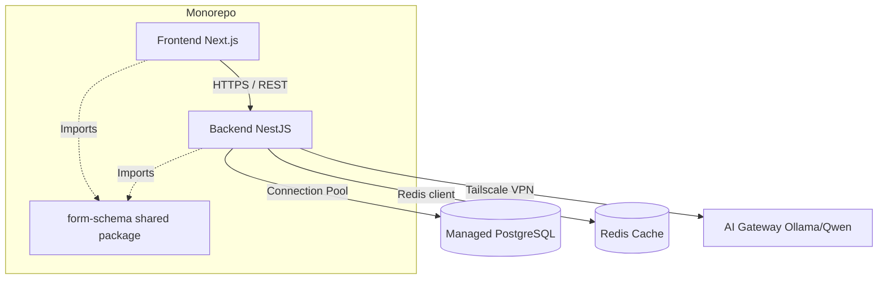

# Architecture Spine — RESCOM System Architecture

## Design Paradigm

**Clean Architecture + Modular Monolith (Monorepo)**
The system is structured as a monorepo managed by **Turborepo**, containing a decoupled React frontend (Next.js) and a Node.js backend (NestJS). The backend follows a Modular Monolith architecture combined with **Clean Architecture**. Features (Auth, Profile, Survey, Ledger, Admin) are separated into logical modules. Within each module, code is strictly divided into layers (Domain, Application, Infrastructure, Presentation) to isolate business rules from frameworks and databases. All modules run within a single NestJS process and share a single PostgreSQL database connection pool.

## Invariants & Rules



### AD-1 — Immutable Double-Entry Ledger [ADOPTED]
- **Binds:** Point System, Survey System, Backend
- **Prevents:** Point duplication, race conditions, or unexplainable balance changes.
- **Rule:** Point balances are never updated directly (`UPDATE points SET balance = ...`). Every point movement is an append-only transaction consisting of a debit and a credit. All ledger transactions must be wrapped in ACID database transactions.

### AD-2 — Centralized Form Schema (Shared Package) [ADOPTED]
- **Binds:** Frontend (Form Builder, Renderer), Backend (Validation), AI Gateway
- **Prevents:** Mismatched form schemas where the frontend builder generates a JSON the backend rejects.
- **Rule:** The `form-schema` (Zod definitions) must be an isolated package in the Turborepo. Both the Next.js frontend and NestJS backend must import this package. AI-generated JSON must be validated against this schema by the backend before saving.

### AD-3 — Optional AI Dependency [ADOPTED]
- **Binds:** AI Module, Survey Creation Flow
- **Prevents:** The core system (login, survey feed, responses, points) going down when the gaming laptop/AI server is offline.
- **Rule:** The AI Gateway must be an optional dependency. If the Ollama server is unreachable or times out, the backend must gracefully fail the AI generation request, and the frontend Form Builder must continue to function normally.

### AD-4 — Secure AI Communication [ADOPTED]
- **Binds:** AI Integration, Infrastructure
- **Prevents:** Public exposure of the local GPU server.
- **Rule:** The AI server must never expose port 11434 to the internet. Communication between the VPS Backend and the AI Laptop must happen exclusively over a private Tailscale VPN. The backend is the only authorized client.

### AD-5 — In-Process Background Jobs
- **Binds:** Task Scheduling (Auto Refund, Pending Expiry)
- **Prevents:** Operational complexity of managing separate worker containers during the initial GO LIVE phase.
- **Rule:** Background jobs run within the main NestJS process using its native `@nestjs/schedule` module. Redis is available for distributed locking if scaling to multiple instances occurs later.

### AD-6 — Redis as Primary Cache Layer
- **Binds:** Time Barrier, Rate Limiting, Session Management
- **Prevents:** State fragmentation if the backend scales horizontally in the future.
- **Rule:** Use Redis from Day 1 for caching Time Barrier state and rate limiting, completely avoiding Node.js in-memory stores.

### AD-7 — The Dependency Rule (Clean Architecture)
- **Binds:** All Backend Modules
- **Prevents:** Business logic becoming tightly coupled to frameworks (NestJS, Prisma, Express) making it hard to test or replace.
- **Rule:** Source code dependencies must only point INWARD toward the Domain layer. The Domain layer (Entities, core business rules) cannot import from the Application layer (Use Cases). The Application layer cannot import from Infrastructure (Prisma, HTTP clients, Controllers). Data access must be handled via Interfaces/Repositories defined in the Application layer and implemented in the Infrastructure layer.

## Consistency Conventions

| Concern | Convention |
| --- | --- |
| **API Format** | RESTful JSON, standard envelope: `{ data, error, meta }` |
| **Validation** | Zod schemas, applied at API boundaries. |
| **Authentication** | Stateless JWT stored in HTTP-Only cookies. |
| **Data Types** | Database IDs use UUIDv4 or NanoID; dates use ISO-8601 UTC. |

## Stack

| Name | Version |
| --- | --- |
| Next.js | 14 (App Router) |
| Node.js / NestJS | 20 / 10.x |
| PostgreSQL | 16 (Managed on Neon/Supabase) |
| Redis | 7.x |
| Prisma | 5.x |
| Turborepo | latest |
| Ollama / Qwen | latest / Qwen2 (or specific model size) |
| Tailscale | latest |

## Structural Seed

```text
rescom-monorepo/
  apps/
    web/                 # Next.js Frontend
      app/
      components/
      features/
    api/                 # NestJS Backend
      src/
        modules/         # auth, users, surveys, points, ai
          [module_name]/
            domain/      # Entities, value objects, business rules
            application/ # Use cases, DTOs, interface ports
            infrastructure/ # Prisma repos, external APIs
            presentation/   # Controllers, Resolvers
        common/          # Shared filters, interceptors, decorators
      prisma/
  packages/
    form-schema/         # Zod schemas shared across FE/BE
    shared-types/
    config/
      eslint, typescript
```

## Deferred

- **B2B / Organization Accounts:** The data model does not yet account for multi-tenant departments or corporate billing.
- **Advanced Payment Gateway Integration:** Manual top-ups are handled via Admin. Webhooks for MoMo/VNPay are deferred.
- **Distributed Job Workers:** Deferred until traffic necessitates offloading cron jobs from the main API process.
