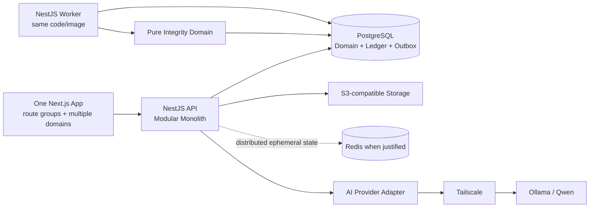
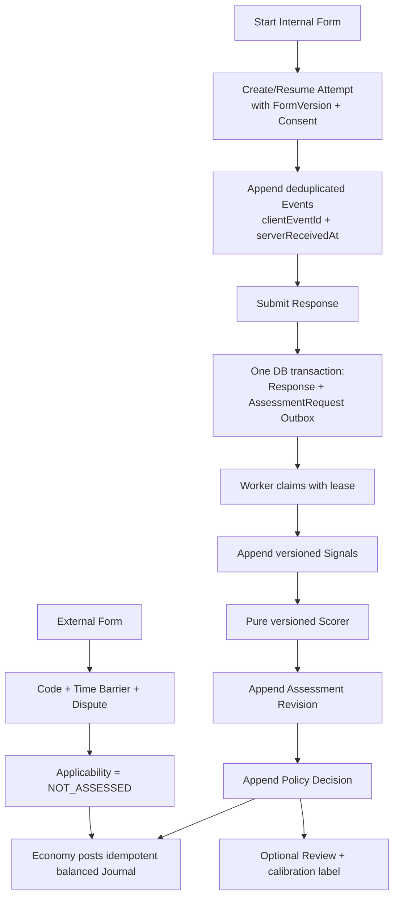

# RESCOM Architecture Health Review

## Executive verdict

**Architecture Health Score: 4.2/10 — not safe for parallel feature development or production deployment.**

The strategic direction is viable: a NestJS modular monolith, PostgreSQL source of truth, immutable Form Versions, transactional outbox, internal-only Research Integrity Engine, progressive policy enforcement, and optional AI are all defensible choices. The failure is convergence. The canonical SPEC/spine, the separate `RESCOM Architecture V2` document, and the current Prisma schema describe materially different systems.

Development should pause at the schema/migration boundary—not at all coding—until the P0 authority and data-contract conflicts are resolved. Authentication and repository foundations can proceed only after the package baseline and security-story ordering are reconciled.

## Scorecard

| Dimension | Score | Assessment |
| --- | ---: | --- |
| Strategic feasibility | 7.0/10 | Technology families and modular-monolith direction fit the product stage. |
| Requirements alignment | 5.0/10 | Canonical SPEC and spine align, but the V2 document and schema contradict them. |
| Documentation consistency | 3.0/10 | Multiple architecture authorities permit incompatible implementations. |
| Module boundaries / maintainability | 4.5/10 | Ownership intent is good; strict four-layer repetition and excessive submodules add ceremony. |
| Data integrity | 2.0/10 | Ledger, versioning, telemetry, assessment lineage, and outbox guarantees are not enforceable. |
| Security / privacy | 3.0/10 | Principles exist; consent, retention, CSRF, session authority, audit, and production controls do not. |
| Scalability / recoverability | 5.0/10 | PostgreSQL + outbox is sound, but claim/lease/idempotency semantics and worker topology are unresolved. |
| Implementation alignment | 2.0/10 | Frontend is a starter; backend, shared packages, migrations, Redis, Turborepo, and CI are absent. |
| Production readiness | 1.0/10 | No deployable backend, migration history, runtime tests, CI/CD, observability, DR evidence, or running local DB. |

The score deliberately distinguishes a promising target architecture from current architectural health. A mechanically clean document is not sufficient when its invariants are not represented by code or schema.

## Authority and evidence model

### Canonical contract

The canonical SPEC explicitly names these companions as the complete build contract:

1. `_bmad-output/specs/spec-rescom/SPEC.md`
2. Final PRD and integrity addendum
3. `ARCHITECTURE-SPINE.md`
4. `solution-design.md`
5. `epics.md`

The finalized spine declares itself binding and the solution design states that it cannot override spine decisions.

### Competing documents

Two byte-identical copies of `RESCOM Architecture V2 — Research Integrity Engine` exist, but neither is a companion of the canonical SPEC nor a source of the finalized spine:

- `RESCOM Architecture V2 — Research Integrity Engine 3b6c370d487e803eb34efd2299bd9bc3.md`
- `_bmad-output/planning-artifacts/architecture/RESCOM-Architecture-V2.md`

They must be treated as an unratified proposal until reconciled. Their incompatible rules are already reflected in the uncommitted Prisma schema, making this an active implementation risk rather than a documentation-only concern.

### Implementation evidence inspected

- All tracked/untracked repository files outside dependency/build directories
- Root, backend, and frontend manifests/lockfiles
- Current Prisma schema and config
- Docker Compose
- Current frontend source
- Git status, history, and current diffs
- Sprint/story state
- BMAD SPEC, PRD, addendum, epics, spine, memlog, solution design, readiness report, reconciliation, and prior reviews
- Required BMAD deterministic linter and three independent reviewer-gate passes

## Critical issues

### C-01 — Split-brain architecture authority

**Evidence**

- Canonical SPEC CAP-5, spine AD-8, and solution design require External responses to be `NOT_ASSESSED`.
- Architecture V2 §7.2 gives External responses an `IntegrityAssessment with reduced confidence`.
- Canonical spine AD-13 and PRD addendum reserve `FraudLog` for security violations.
- Architecture V2 §14 replaces FraudLog with `IntegrityIncident`; the current Prisma schema removed `FraudLog`.
- Spine AD-5 and solution design use an in-process processor/one deployable process.
- Architecture V2 deploys a separate NestJS worker process/container.

**Impact:** Teams can obey a named architecture document and still build mutually incompatible response, fraud, reward, and deployment behavior.

**Required action:** Declare the SPEC + spine + PRD/addendum canonical. Archive both V2 copies after extracting compatible material. Do not migrate the current schema until this reconciliation is complete.

### C-02 — The financial schema is not double-entry

**Evidence**

- Spine AD-1 requires every point movement to be a balanced debit and credit.
- `LedgerTransaction` contains one `userId`, one `balanceType`, one signed `amount`, and no journal or entry pair.

**Impact:** The database cannot prove conservation of points, balanced movement, escrow ownership, or atomic transfer semantics. Idempotency alone cannot prevent mint/loss errors.

**Required action:** Replace the current ledger table design with a journal/transaction header plus at least two immutable entries posted to explicit ledger accounts. Enforce balanced totals per journal, currency/point unit, idempotency, and append-only permissions.

### C-03 — Form/version/attempt/response identity is not enforceable

**Evidence**

- Canonical docs require every Response, Attempt, event, assessment, and Survey Quality snapshot to reference one immutable Form Version.
- The schema has a self-referencing `Form` with `versionNumber`, no explicit `FormVersion` entity, and nullable scalar `formVersionId` fields without foreign keys.
- `SurveyAttempt.respondentId` is required, while the canonical contract allows Guest Internal responses.
- `Response` separately stores `formId`, `attemptId`, and `respondentId`; the database cannot guarantee they agree with the linked attempt.

**Impact:** Historical answers and integrity evidence can drift across users and versions, and canonical guest flows cannot be represented.

**Required action:** Introduce an explicit immutable `FormVersion`; make Attempt the authoritative submission context; model guest identity intentionally; derive or constrain duplicated respondent/form references.

### C-04 — The integrity pipeline cannot satisfy the canonical contract

**Evidence**

- `IntegrityEvent` lacks client event ID, consent-notice version/reference, explicit server-received timestamp, Response link, and a validated payload contract. Sequence-only deduplication is insufficient across retries/devices.
- No durable `IntegritySignal`/feature snapshot record exists even though SPEC CAP-2 requires replayable signals stored separately from raw events.
- `IntegrityAssessment` lacks applicability, evidence coverage, operational decision, assessment revision, immutable policy relation, assessed timestamp semantics, and uniqueness/lineage constraints.
- Respondent Reliability is represented as one mutable `RespondentReputation` row; Survey Quality snapshots and TrustEdge projections are absent.
- `OutboxEvent` lacks a unique idempotency key, aggregate version, claim owner/lease, next retry, terminal failure/dead-letter data, and processed-event deduplication contract.

**Impact:** CAP-1 through CAP-7 and the success signals cannot be proven, replayed, or made concurrency-safe.

**Required action:** Redesign the integrity/outbox portion of the schema from the canonical contract before generating the first migration.

### C-05 — Privacy and governance gates block production telemetry

**Evidence**

- Retention, policy-promotion authority, Survey Quality evidence minimums, and review/appeal ownership remain open in the spine.
- The schema already introduces behavioral telemetry and incident evidence without consent or retention records.
- Raw identifiers are repeated across events/assessments, and `Response.ipAddress` is mandatory with no retention/minimization policy.

**Impact:** Production collection could begin without provable consent, deletion, access, purpose limitation, or fair-policy governance.

**Required action:** No production telemetry before consent versioning, data classification, retention/deletion rules, access audit, and SHADOW-only governance are approved and represented in stories/schema.

## High issues

### H-01 — Backend and workspace architecture are targets only

There is no NestJS source tree, no root workspace configuration, no shared packages, and no Turborepo. The backend contains only Prisma files and a placeholder package manifest. The architecture is not ratified by executable module boundaries.

### H-02 — No migration history or runtime database evidence

The Prisma schema validates syntactically, but there are no migration files. Docker was unavailable during review, so applied database state and constraint behavior are **INSUFFICIENT EVIDENCE**. The README recommends both `db push` and migrations, which risks unmanaged schema drift.

### H-03 — Worker topology and ownership are contradictory

In-process API jobs and a separate worker container are both documented. Heavy integrity/AI processing competes with request latency if kept inside API replicas; separate workers require claim/lease semantics absent from the schema.

### H-04 — Prisma package family and runtime baseline are inconsistent

`prisma` and `@prisma/client` are `6.0.0`; `@prisma/config` is `7.9.1`. The backend README permits Node 18, while current Prisma 7 and NestJS 11 require Node 20+; the observed local Node 22.18.0 is compatible, but no repository `engines`/toolchain pin exists. Official Prisma guidance requires upgrading CLI and client together.

### H-05 — Security/session architecture is incomplete

The product requires stateless HTTP-only cookie JWTs and immediate single-session invalidation. No binding claim/session-version contract, key rotation, CSRF policy, refresh/expiry policy, origin policy, audit event contract, or global authorization posture exists in implementation. Story 1.6 currently follows auth stories even though it owns the baseline security foundation.

### H-06 — User capability and demographic models are incomplete

Docs say a user can act as Publisher and Respondent; the schema stores one mutually exclusive role without declaring capability inheritance. `DemographicProfile` omits required gender, occupation, academic major/year, school, and other targeting fields.

### H-07 — Integrity telemetry mixes unrelated domain events

`IntegrityEventType` contains reward, escrow, policy, and review events. This makes the Integrity telemetry table a cross-domain event bus, conflicting with exclusive module ownership and obscuring which events are user telemetry versus immutable business facts.

### H-08 — Append-only/versioned rules are not enforced

Prisma models alone do not prevent updates/deletes to assessments, events, incidents, reviews, policies, or ledger rows. No database permissions, triggers, application repository restrictions, or audit proof exists.

### H-09 — Strict four-layer Clean Architecture everywhere is over-engineered

The dependency rule is valuable at domain and external-system seams. Requiring Domain/Application/Infrastructure/Presentation directories for every small CRUD feature creates ceremony and indirection before business logic exists. Enforce module ownership and dependency direction; introduce ports where volatility or business invariants justify them.

### H-10 — Turborepo and Redis are prematurely mandatory

Shared packages need a workspace, but they do not require Turborepo initially. Redis is justified for distributed rate limits/time barriers and multi-replica coordination, but not as a prerequisite for the first single-instance auth/form slice. PostgreSQL should own outbox claims. Add Redis when the first feature actually needs distributed ephemeral state or a second API replica is introduced.

### H-11 — Production deployment, observability, backup, and recovery are unproven

There is no backend Dockerfile, reverse-proxy config, CI/CD, health endpoint, telemetry stack, backup policy, restore test, RPO/RTO, secret management implementation, or load-test evidence. Production provider, AI hardware/model fit, and multi-replica behavior are **INSUFFICIENT EVIDENCE**.

## Medium issues

### M-01 — Frontend topology is over-split in documentation

Four public hostnames are described as separate Next.js frontends, while the repository has one starter app. One Next.js application can initially serve landing, authenticated, public survey, and admin route groups and accept multiple domains. Split deployments only when independent security/release/scaling evidence justifies them.

### M-02 — Local infrastructure is incomplete

Compose contains only PostgreSQL, hard-coded development credentials, and an obsolete `version` key. Redis, object storage emulation, API, and worker are absent. This is acceptable for a database-only scaffold, not for claimed full-stack local parity.

### M-03 — API/event contracts are conventions, not shared artifacts

The `{data,error,meta}` envelope and event/applicability types exist only in prose. `packages/form-schema` and `packages/integrity-contracts` do not exist, so frontend/backend compatibility cannot be checked.

### M-04 — Source provenance is stale

The spine cites `rescom.md` as a source, but that file is deleted in the current worktree. `srs_rescom.md` and the source DOCX are also deleted. The canonical documents may intentionally supersede them, but provenance and archive policy are not recorded.

### M-05 — Duplicate V2 documents invite drift

The same 1,392-line proposal exists at the repository root and inside planning artifacts. Keeping duplicate mutable copies provides no value.

### M-06 — Sensitive-data minimization is underspecified

Events and assessments repeat `respondentId`; responses require raw IP; incident/review evidence is arbitrary JSON. No encryption, hashing, field allowlist, retention, or redaction contract is represented.

### M-07 — Production provider choices remain placeholders

Neon versus Supabase, Nginx versus Caddy, and object-storage provider are undecided. This is acceptable as seed only; connection limits, pooling, backup ownership, egress, regions, and failure behavior are **INSUFFICIENT EVIDENCE**.

### M-08 — Quality gates are absent

Root/backend `npm test` scripts intentionally fail because no tests exist. Frontend lint and TypeScript pass, but the UI is the untouched Create Next App starter. There is no CI, architecture-boundary test, schema-contract test, or migration test.

## Low issues

### L-01 — Structural naming drifts

Docs alternate between `apps/api`, `apps/backend`, `apps/web`, `apps/frontend/my-app`, feature modules, and fine-grained integrity modules. Actual paths should become the seed once selected.

### L-02 — Schema naming quality is inconsistent

The `Form` relation field `SurveyAttempt` uses type-style capitalization while other relation fields use lower camel case. Naming inconsistencies increase generated-client friction.

### L-03 — Enumerations are visibly incomplete

Notification and transaction enums do not cover many documented workflows. These should be derived per story rather than expanded speculatively, but the current schema is not a complete production model.

### L-04 — Numeric/data constraints need explicit implementation decisions

Score/confidence ranges, decimal scale, non-negative reward/amount checks, sequence monotonicity, and JSON schema version constraints are not enforced.

## Documentation vs implementation mismatches

| Contract / decision | Canonical documentation | Current implementation | Verdict |
| --- | --- | --- | --- |
| NestJS modular monolith | Adopted | No backend source | Missing |
| Monorepo/shared contracts | Turborepo + shared Zod packages | Root is not a workspace; `packages/` has no files | Missing / overbound |
| PostgreSQL | Source of truth | Compose 15 Alpine + valid Prisma schema | Partial |
| Redis | Day-1 cache/rate-limit/session target | Not installed or composed | Missing; timing should be reconsidered |
| JWT cookie auth | Required | No auth code/config | Missing |
| Single-session invalidation | Required | No session/version state | Missing |
| Double-entry ledger | AD-1 | One-row `LedgerTransaction` | Contradiction |
| Immutable Form Version | Required | Self-referencing `Form`; no version FK targets | Contradiction |
| Guest Internal responses | Supported | Attempt requires User | Contradiction |
| Consent-aware event ingestion | Required | No consent/client-event contract | Contradiction |
| Replayable signals | Required | No signal/feature snapshot record | Missing |
| Versioned assessment contract | Score, confidence, coverage, decision, policy, revision | Several fields/relations absent | Contradiction |
| Independent dimensions | Response Integrity, Reliability, Survey Quality | Assessment + mutable Reputation only | Missing |
| External applicability | `NOT_ASSESSED` | V2 says reduced-confidence assessment; schema has no applicability | Conflict |
| Integrity/fraud separation | FraudLog remains separate | FraudLog removed; V2 replacement reflected | Contradiction |
| Progressive enforcement | SHADOW → ADVISORY → ENFORCED | Enum only; no approval/audit/promotion proof | Partial |
| TrustGraph projection | Relational, restricted, rebuildable | No projection model | Missing |
| Outbox reliability | Transactional, idempotent, distributed claim | Generic row without idempotency/lease | Contradiction |
| AI optional/private | Tailscale/Ollama/Qwen | No integration or operational evidence | Not implemented / insufficient evidence |
| Production operations | Isolated environments, monitoring, recovery | No configs or runtime evidence | Missing |

## Major-decision disposition

| Decision | Disposition | Optimized rule |
| --- | --- | --- |
| Modular monolith | **KEEP** | One deployable codebase with explicit bounded-context ownership. |
| NestJS backend | **KEEP** | Pin one supported NestJS 11 family on Node 22 LTS when scaffolding. |
| PostgreSQL source of truth | **KEEP** | Use for domain state, outbox, claims, relational trust projections, and ledger. |
| Prisma ORM | **MODIFY** | Align one major family; because no app/migrations exist and Node 22 is present, evaluate a clean all-Prisma-7 baseline rather than mixing majors. |
| Strict four layers in every module | **MODIFY** | Enforce inward dependencies at real domain/external seams; allow simple feature-local handlers/repositories when no domain abstraction is gained. |
| Top-level module granularity | **MODIFY** | Keep Identity, Research, Participation, Economy, Integrity, Marketplace, Moderation, Notifications; keep scoring/signals/reliability/quality as internal Integrity components. |
| REST JSON + Zod contracts | **KEEP** | Materialize versioned shared packages and contract tests. |
| Transactional outbox | **KEEP + MODIFY** | Add idempotency, aggregate version, claim lease, retry/backoff, and processed-handler deduplication. |
| In-process background jobs in API | **REPLACE** | Same code/image, separate API and worker entrypoints; permit co-location only in local/small single-process mode. |
| Redis from Day 1 | **MODIFY** | Add when distributed throttling/time-barrier state or multiple API replicas require it; do not use it as the authoritative outbox. |
| Turborepo as an invariant | **REMOVE / DEFER** | Start with npm workspaces for shared packages; add Turbo when cross-package build caching/orchestration has measured value. |
| Four separate frontend apps | **MODIFY** | Start with one Next.js app and route groups/multiple domains; split only for proven release/security isolation. |
| Double-entry ledger concept | **KEEP** | Replace the current schema with balanced journal + entries. |
| Form self-versioning | **REPLACE** | Explicit Form/Survey aggregate + immutable FormVersion. |
| Internal-only full Integrity Engine | **KEEP** | Only Internal Forms produce full assessments/reliability/quality evidence. |
| External reduced-confidence assessment | **REMOVE** | External responses are explicitly `NOT_ASSESSED`; keep Time Barrier/code/dispute controls separate. |
| IntegrityIncident replaces FraudLog | **REMOVE** | Keep integrity findings/reviews distinct from security FraudLog. |
| Score separated from policy decision | **KEEP** | Persist immutable assessment and separate idempotent policy decision. |
| Progressive enforcement | **KEEP + MODIFY** | Persist promotion authority, evidence, audit, effective dates, and rollback; remain SHADOW until gates pass. |
| Optional AI via provider/Tailscale | **KEEP** | AI supplies drafts/signals only and never blocks core paths or owns decisions. |
| Kafka/Kubernetes/graph DB/feature store | **KEEP DEFERRED** | Introduce only from measured load/query/organizational evidence. |
| Architecture V2 as active authority | **REMOVE / ARCHIVE** | Reconcile compatible sections into an updated spine/solution design, then retain one historical copy. |

## Recommended optimized architecture

### Paradigm

**Pragmatic Modular Monolith + Transactional Outbox.**

- One repository workspace and one backend codebase.
- One Next.js application initially, mapped to multiple domains/routes as needed.
- One NestJS API entrypoint and one worker entrypoint built from the same image/code.
- PostgreSQL owns all durable state and work claims.
- Redis is an optional distributed-ephemeral dependency, not a domain source of truth.
- Ports/adapters are mandatory around database ownership, ledger, storage, AI, email, and cross-module commands—not as ceremony for every trivial function.

### Bounded contexts

| Context | Owns | Communicates through |
| --- | --- | --- |
| Identity | Users, auth identities, session version, demographics, permissions | Auth claims, application ports |
| Research | Survey/Form aggregate, immutable FormVersion, targeting | Version IDs and published contracts |
| Participation | Attempt, Response, answer/submission lifecycle | Transactional outbox |
| Economy | Ledger accounts, journals/entries, escrow, settlement | Idempotent commands/decision IDs |
| Integrity | Consent, events, signals, assessment, policy decision, reliability, quality | Outbox handlers and safe projections |
| Marketplace | Eligibility/ranking read models | Approved projections only |
| Moderation | Survey moderation, disputes, integrity reviews, security FraudLog workflows | Audited decisions/events |
| Notifications | Notification state and delivery | Outbox/application events |
| AI adapter | Form generation and semantic signal provider | Time-bounded port; no authority |

### Canonical data flow

### Minimum durable model corrections

1. `Form` / `Survey` aggregate plus immutable `FormVersion`.
2. `SurveyAttempt` referencing exact version; intentional nullable/authenticated participant model.
3. `Response` referencing Attempt; eliminate or constrain duplicated identity/version fields.
4. `IntegrityConsent` with notice version, scope, timestamps, and revocation/lifecycle semantics.
5. `IntegrityEvent` with client event ID, server receipt time, schema version, consent reference, validated payload, and dedupe key.
6. `IntegritySignal`/feature snapshot with derivation/scoring input versions and source lineage.
7. `IntegrityAssessment` with applicability, coverage, decision-independent score, policy relation, revision, reason codes, and unique lineage.
8. Append-only `RespondentReliabilitySnapshot` and `SurveyQualitySnapshot` with evidence windows and policy/source lineage.
9. Separate `IntegrityReview`/finding records and security `FraudLog`.
10. Rebuildable typed `TrustEdge` projection, never authoritative.
11. `LedgerJournal` + balanced `LedgerEntry` rows and idempotent command reference.
12. `OutboxEvent` with idempotency, aggregate version, lease/claim, retry/backoff, terminal failure, and handler-deduplication semantics.

## Prioritized changes required before continuing development

### P0 — Architecture and schema gate

1. **Declare authority:** SPEC + finalized PRD/addendum + spine are canonical.
2. **Archive/reconcile Architecture V2:** remove its external-assessment, FraudLog-replacement, and worker contradictions; keep one historical copy.
3. **Freeze `db push` and migration generation** from the current schema.
4. **Redesign four load-bearing contracts:** FormVersion/Attempt/Response, double-entry Ledger, Integrity pipeline, and Outbox claims.
5. **Resolve privacy launch gates:** consent, retention/deletion, access/audit, policy promotion, review/appeal, and Survey Quality evidence threshold.
6. **Run a BMAD architecture Update** to amend ADs without renumbering them, then re-run reviewer gate.

### P1 — Foundation before public auth/features

1. Pin Node 22 LTS and one Prisma major family; prefer evaluating a clean Prisma 7 baseline because no backend application/migrations exist.
2. Pin a compatible NestJS 11 package family and add repository `engines`/toolchain files.
3. Use npm workspaces for `apps/*` and `packages/*`; defer Turborepo until needed.
4. Create shared Zod API/form/integrity contracts with compatibility tests.
5. Scaffold NestJS modules using the optimized boundaries.
6. Move or split Story 1.6 so security/config/error/CORS/CSRF/rate-limit foundations precede externally reachable auth endpoints.
7. Establish migrations, isolated test DB, CI, architecture-boundary tests, and secret-safe configuration.

### P2 — Core product path

1. Implement Identity, Research/FormVersion, Participation, and balanced Economy before integrity scoring.
2. Implement External Forms through Completion Code/Time Barrier with explicit `NOT_ASSESSED` applicability.
3. Implement internal submission + transactional outbox and a separate worker entrypoint from the same backend artifact.
4. Add S3-compatible uploads and audited admin/security flows.

### P3 — Integrity in SHADOW

1. Collect only approved, consented Internal Form telemetry.
2. Add replayable signal derivation and pure versioned scoring.
3. Keep every new policy in SHADOW; no reward impact.
4. Measure evidence coverage, processing latency, failure rates, cohort fairness, and review overturn rates.
5. Add Reliability, Survey Quality, and Trust projections only after enough valid evidence exists.

### P4 — Scale only from evidence

1. Add Redis when distributed ephemeral coordination is required.
2. Split frontend/backend deployments only for measured release/security/traffic isolation.
3. Consider streaming, graph infrastructure, analytics DB, or microservices only after query/load/team boundaries justify them.

## Production-readiness evidence still missing

The following are explicitly **INSUFFICIENT EVIDENCE**:

- Applied database state, migrations, and constraint behavior (Docker daemon unavailable; no migration history)
- Production provider/version, pooling, regions, connection budgets, backups, restore tests, RPO/RTO
- Backend container, reverse proxy, TLS/origin configuration, deployment topology, health checks
- CI/CD, dependency scanning, secret scanning, SAST/DAST, penetration testing
- JWT key storage/rotation, CSRF behavior, session invalidation, admin audit access
- Redis topology and failure policy
- Object-storage bucket policy, malware scanning, MIME/size enforcement
- Ollama/Qwen model choice, GPU memory/throughput, timeout/fallback, model licensing and data handling
- Load profile, peak concurrency, event volume, storage growth, retention cost, and SLO performance
- Monitoring, alerting, incident response, on-call ownership, and disaster recovery
- Team size/ownership capable of sustaining the proposed module/process split

No claim of production readiness, horizontal scalability, or privacy compliance should be made until evidence exists for these items.

## Verification performed

| Check | Result |
| --- | --- |
| BMAD deterministic spine lint | PASS — 0 findings |
| Prisma schema validation | PASS syntactically |
| Prisma package tree | FAIL alignment — v6 CLI/client + v7 config |
| Root tests | FAIL — placeholder “no test specified” |
| Backend tests | FAIL — placeholder “no test specified” |
| Frontend ESLint | PASS |
| Frontend TypeScript | PASS |
| Docker runtime / database | INSUFFICIENT EVIDENCE — daemon unavailable |
| Migration history | ABSENT |
| Backend build/runtime | ABSENT |
| Shared contract packages | ABSENT |
| CI/CD | ABSENT |

## Current technology reality

- Next.js 16.3.0 is represented by the frontend manifest and was officially released on 2026-08-03. Keep a supported-patch policy rather than pinning architecture prose to one patch.
- NestJS 11 is the current documented major and requires Node 20+; observed Node 22.18.0 fits, but the README's Node 18 floor does not.
- Prisma 7 is current GA and its official upgrade guide requires `prisma` and `@prisma/client` to move together. The repository's mixed-major state is unsupported as a coherent baseline.
- PostgreSQL 15 remains officially supported through 2027-11-11 and is a valid compatibility floor. Use a current 15.x minor or a deliberately selected newer supported major.

Official references:

- [Next.js official release/security news](https://nextjs.org/blog)
- [NestJS 11 migration and Node requirements](https://docs.nestjs.com/migration-guide)
- [Prisma 7 upgrade guide](https://docs.prisma.io/docs/orm/v6/more/upgrades/to-v7)
- [Prisma system requirements](https://docs.prisma.io/docs/orm/reference/system-requirements)
- [PostgreSQL versioning/support policy](https://www.postgresql.org/support/versioning/)

## Independent reviewer gate

The required BMAD gate ran after deterministic lint:

- Rubric/security/data/production review: **FAIL, 4.8/10** — `reviews/review-current-architecture-rubric-2026-08-16.md`
- Adversarial boundary review: **4.0/10, not ready** — `reviews/review-current-adversarial-boundaries-2026-08-16.md`
- Version/reality review: **FAIL** — `reviews/review-current-version-reality-2026-08-16.md`

All reviewers independently converged on Ledger invalidity, canonical/schema drift, missing event/assessment/outbox invariants, conflicting architecture authorities, and insufficient production evidence.

## Recommended next action

Run `bmad-architecture` in **Update** mode using this report. Keep existing AD IDs stable, amend the contradictory rules, add only the missing enforceable invariants, reconcile/retire Architecture V2, then update the schema and Story 1.1 before starting `bmad-dev-story`.
