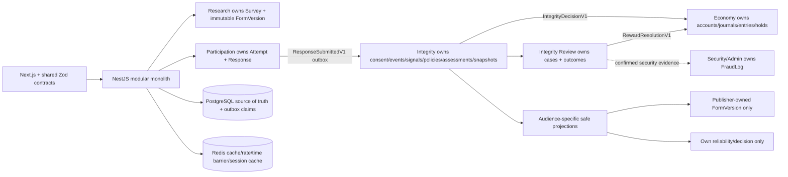

# Current Architecture Adversarial Boundary Review

**Date:** 2026-08-16  
**Lens:** Independently built units that obey every Architecture Decision (AD) yet can still diverge  
**Scope:** Canonical SPEC/PRD/addendum, Architecture Spine, solution design, RESCOM Architecture V2, and the current repository/schema  
**Mutation policy:** Review only; no architecture, schema, or application code was changed

## Verdict

**Architecture Health Score: 4.0/10 — NOT READY for parallel implementation or production.**

The current Architecture Spine has the right high-level direction: a modular monolith, inward dependencies, exclusive state ownership, PostgreSQL outbox processing, immutable scoring inputs, a separate Ledger authority, and strict evidence boundaries. However, independent teams can still implement mutually incompatible contracts while following every AD literally. More seriously, the current Prisma schema is syntactically valid but contradicts the most safety-critical invariants: it is not double-entry, does not preserve the canonical Integrity event/assessment shapes, cannot represent guest Internal attempts, does not make Form Version references authoritative, collapses Integrity Review into Incident/Fraud-shaped records, and cannot prove safe multi-replica outbox claiming.

The implementation-readiness report's claim that the schema is synchronized and the project is ready is contradicted by direct repository evidence. Development may continue only on isolated foundation stories that do not freeze these broken seams. Parallel work on Ledger, Participation, Integrity, Moderation, jobs, or Publisher analytics should wait until the P0 contracts below are bound.

## Evidence and Authority

### Evidence order used

1. `_bmad-output/specs/spec-rescom/SPEC.md` explicitly declares itself and its companions to be the canonical build/test contract.
2. Canonical companions: finalized PRD, Integrity addendum, Architecture Spine, solution design, and epics.
3. `apps/backend/prisma/schema.prisma` and package/deployment manifests are authoritative for current implementation reality.
4. `_bmad-output/planning-artifacts/architecture/RESCOM-Architecture-V2.md` is reviewed as an earlier/full design input. It is not listed as a SPEC companion and may not override the canonical contract.

### Verified current reality

- The spine linter passes with zero mechanical findings.
- `npx prisma validate` succeeds, proving only that the Prisma schema is syntactically valid.
- The backend has Prisma files and dependencies but no NestJS source tree, application services, controllers, workers, tests, or migrations.
- The root has no Turborepo configuration; `packages/form-schema` and `packages/integrity-contracts` do not exist.
- Docker Compose provides PostgreSQL only; Redis, API, worker, reverse proxy, and production isolation are not implemented.
- Prisma dependencies are split across incompatible declared families: `prisma`/`@prisma/client` 6.0.0 and `@prisma/config` ^7.9.1 (`apps/backend/package.json:12-16`).
- **INSUFFICIENT EVIDENCE:** Runtime performance, horizontal safety, security controls, recovery behavior, production deployment, access auditing, and NFR compliance cannot be validated because the relevant implementation does not exist.

## Adversarial Construction: Compliant Units That Still Clash

Every pair below can otherwise comply with AD-1 through AD-18. The collision exists because the AD text permits both choices or leaves the cross-unit contract unstated.

| Boundary | Independently built unit A | Independently built unit B | Why both obey the ADs | Result | Severity |
|---|---|---|---|---|---|
| Shared IDs | Shared contract authors choose NanoID identifiers because the convention permits “UUIDv4 or NanoID.” | Prisma adapters persist native UUID columns, matching the current schema. | The spine explicitly permits either representation (`ARCHITECTURE-SPINE.md:160`). | NanoID values fail at PostgreSQL UUID boundaries or force ad-hoc conversion; event IDs and aggregate IDs no longer round-trip. | HIGH |
| Shared Form schema rollout | Frontend deploys `schemaVersion: 2` and a new block variant from the shared package. | Backend is independently deployed from an older build of that same shared package and accepts only v1. | AD-2 requires a shared package, but not coordinated deployment, compatibility windows, or down-conversion. | The builder emits valid JSON that the deployed backend rejects—the exact divergence AD-2 says it prevents. | HIGH |
| Form/Form Version identity | Research models each published version as another `Form` row linked by `parentFormId`. | Participation treats `formId` as survey identity and stores a separate optional `formVersionId`. | No AD binds the canonical identity model; AD-9 merely requires links. | Responses, attempts, events, quality snapshots, and exports cannot agree on the immutable version key. | CRITICAL |
| Review ownership | Integrity Scoring opens review state next to an Assessment and treats it as scoring-owned. | A separate Integrity Review/Moderation unit creates and owns review cases after consuming an event. | AD-16 requires an owner but does not name the owner of each record; both units are “Integrity” modules. | Duplicate review cases, incompatible status transitions, and unclear label/reward authority. | HIGH |
| Cross-module mutation path | Participation calls an Economy application port synchronously after submission. | Integrity emits an asynchronous decision event consumed later by Economy. | AD-16 explicitly allows “application ports or events”; AD-14 does not define a single reward state machine. | A response can be acknowledged before, during, or after reward posting; retries can credit then hold, hold then credit, or create competing commands. | CRITICAL |
| Domain event contract | Response Outbox emits `response.submitted.v1` keyed by `responseId`. | Integrity consumes `SURVEY_SUBMITTED` keyed by `attemptId` using the telemetry event enum. | AD-10 requires an outbox record but binds no event name, envelope, aggregate identity, schema version, ordering, or compatibility rule. | Producer and consumer can both be compliant and never interoperate. | HIGH |
| Job claiming | Outbox processing uses PostgreSQL row claims and leases. | Scheduled refund/pending-release jobs use Redis locks and locally query eligible rows. | AD-17 permits database **or** Redis claiming/locking and specifies no common lease/fencing protocol. | During rolling deploy, failover, or lock expiry, two compliant workers can process the same economic action using different ownership authorities. | CRITICAL |
| Idempotency semantics | Integrity keys an Economy command by `assessmentId`. | Economy keys a reward by `responseId + rewardType`; a replay creates a new assessment revision. | All calls use idempotency keys, but no AD binds semantic scope or key derivation. | Both unique keys succeed for one business effect; reward, hold, notification, or review duplication remains possible. | CRITICAL |
| Publisher projection | Publisher receives response-level score, safe reasons, policy version, a stable pseudonymous respondent reference, and review state. | Publisher receives only Form-Version aggregates and no response-level subject linkage. | AD-18 names allowed classes of data but not audience-specific fields, row authorization, linkability, or minimum aggregation. | APIs and exports diverge; the permissive implementation can enable re-identification even without raw telemetry. | HIGH |
| Restricted-evidence audit | Admin query service writes an audit record before returning restricted evidence. | Infrastructure grants direct Prisma reads and relies on request logs for auditing. | AD-18 requires “audited access” but defines no mandatory access gateway, audit owner, or immutable audit event. | Some evidence access bypasses durable audit while still being called “audited.” | HIGH |
| Single-session auth | Identity stores a `sessionVersion` in PostgreSQL and caches it in Redis; JWT carries the version. | Identity stores the sole active session ID only in Redis and JWT carries `sid`. | The spine says “stateless JWT” and binds Redis to session management but does not choose an invalidation authority or failure mode. | Tokens, logout behavior, Redis-loss behavior, and Device-A invalidation differ; FR-3 cannot be guaranteed across units. | HIGH |

## Findings by Severity

### CRITICAL

#### C-1 — Current Ledger schema violates the adopted double-entry invariant

**Evidence**

- AD-1 requires every movement to contain a debit and a credit and says balances derive from append-only transactions (`ARCHITECTURE-SPINE.md:63-67`; PRD FR-30 at `prd.md:483`).
- Current `LedgerTransaction` contains one `userId`, one `balanceType`, and one signed/unsigned `amount`; it has no ledger account, journal transaction, debit side, credit side, balancing constraint, or posting group (`schema.prisma:288-300`).

This is not an incomplete double-entry implementation; it is a different accounting model. ACID around one row cannot prove conservation, and a single global `idempotencyKey` cannot replace balanced postings.

**Decision implication:** **REPLACE** the current ledger data design before any migration is treated as durable. Preserve AD-1, but tighten it with canonical `LedgerAccount`, `JournalTransaction`, and at least two immutable `LedgerEntry` rows whose entries balance to zero in one database transaction. Bind the business idempotency key to the whole journal transaction and define lock order.

#### C-2 — Current Participation/Integrity schema cannot represent the canonical contract

**Evidence**

- CAP-1 requires deduplication by client event ID; CAP-3 requires score, confidence, coverage, reason codes, and decision; CAP-4 requires Reliability and Survey Quality; CAP-6 requires Assessment review; CAP-7 requires TrustGraph records (`SPEC.md:22-47`).
- The addendum defines the missing canonical record shapes and uniqueness rules (`addendum.md:109-199`).
- Current `IntegrityEvent` has no `clientEventId`, `responseId`, `receivedAt`, or consent-notice link and deduplicates `(attemptId, sequence)` instead (`schema.prisma:331-349`).
- Current `IntegrityAssessment` has no applicability, evidence coverage, decision, status, assessment revision, assessed-at field, or uniqueness across `(responseId, policyVersion, revision)` (`schema.prisma:352-372`).
- `IntegrityConsent`, `IntegritySignal`, `SurveyQualitySnapshot`, and `TrustEdge` are absent.
- `RespondentReputation` requires a numeric rolling score and has no neutral `UNESTABLISHED` state (`schema.prisma:375-389`).
- Guest responses are allowed, but `SurveyAttempt`, `IntegrityEvent`, and `IntegrityAssessment` require a respondent UUID, making an eligible guest Internal assessment impossible (`schema.prisma:308-369`).

**Decision implication:** **REPLACE** the V2-derived Integrity tables with the canonical addendum shapes before migration. This is schema correction, not a technology rewrite.

#### C-3 — Form Version authority is not enforced

**Evidence**

- FR-18 requires every Response to reference the exact immutable `form_version_id` (`prd.md:355-364`).
- Current `Response` references `formId`; `SurveyAttempt.formVersionId` and `IntegrityEvent.formVersionId` are nullable strings without a foreign key (`schema.prisma:267-283`, `308-347`).
- Architecture V2 itself says every Attempt and Response must reference exact `formVersionId` (`RESCOM-Architecture-V2.md:277-279`).

The current parent/child `Form` representation might be intended to encode versions, but **INSUFFICIENT EVIDENCE** exists to prove that `Response.formId` is always a version row rather than a stable survey identity. Independent Research and Participation implementations can choose differently.

**Decision implication:** **MODIFY** the spine and **REPLACE** the ambiguous schema seam with an explicit stable `Survey/Form` identity plus immutable `FormVersion`, or formally declare that every `Form` row is a version and introduce a separate stable survey/root ID. Make `formVersionId` non-null with a foreign key for Internal attempts, responses, events, signals, assessments, and Survey Quality.

#### C-4 — Economic job execution is not convergent under retries or replicas

**Evidence**

- AD-17 requires distributed claiming and retry safety but permits either database or Redis ownership (`ARCHITECTURE-SPINE.md:143-146`).
- Current `OutboxEvent` has status, attempts, available/processed timestamps, but no unique semantic event key, aggregate sequence, claim owner, claim timestamp, lease expiry, fencing token, error, or dead-letter state (`schema.prisma:440-453`).
- NFR-25 requires retries not to duplicate assessments, reviews, notifications, or ledger actions (`prd.md:1084`).

An application-level “check then mark processed” is unsafe, and a Redis lock does not by itself fence a stale worker. This becomes a money-integrity defect when the same weakness is used for pending release, escrow refund, or reward actions.

**Decision implication:** **MODIFY** AD-10/AD-17 to choose PostgreSQL as the authoritative outbox claim mechanism for MVP, bind atomic claim/lease semantics (for example, row locking with skip-locked claims plus lease recovery), define event uniqueness and aggregate ordering, and make every downstream side effect consume one canonical business idempotency key. Redis may remain for cache/rate limiting without becoming a competing work authority.

### HIGH

#### H-1 — Architecture authority is split and produces contradictory implementations

`RESCOM-Architecture-V2.md` describes External Forms as receiving reduced-confidence Integrity Assessments (`:355-368`), while canonical CAP-5 and AD-8 require External responses to be `NOT_ASSESSED` (`SPEC.md:38-40`; `ARCHITECTURE-SPINE.md:98-101`). V2 also deploys separate NestJS worker processes (`:34`, `:1154`, `:1381`) while AD-5 requires jobs inside the main NestJS process (`ARCHITECTURE-SPINE.md:83-86`). The implementation-readiness report nevertheless labels V2 authoritative and fully synchronized.

**Decision implication:** **KEEP** canonical AD-5 and AD-8 for MVP; **REMOVE** the contradictory V2 external-scoring and dedicated-worker statements from active guidance, or mark Architecture V2 superseded and link to the spine. Do not let stories cite both as peers.

#### H-2 — Integrity Review and Fraud/Incident responsibilities are collapsed in the schema

AD-13 requires Integrity assessments/review routing to remain separate from FraudLog. The addendum defines `IntegrityReview.assessmentId` with neutral outcomes. Current `IntegrityReview` points only to `IntegrityIncident`, and its outcomes include `CONFIRMED_FRAUD`; the prior FraudLog model was removed (`schema.prisma:391-425`). This makes a low-quality assessment travel through a fraud-shaped incident record and provides no direct review-to-assessment lineage.

**Decision implication:** **REPLACE** the incident-only review model. `integrity-review` owns ReviewCase/ReviewOutcome linked to immutable Assessment; the Security/Admin boundary owns append-only FraudLog. A confirmed review may emit a separately authorized security command but may not mutate history or silently recast the assessment.

#### H-3 — AD-16 declares exclusive ownership without a binding owner registry

The solution design contains an owner table (`solution-design.md:217-231`), but the spine only says “the owning Integrity module” and Architecture V2 places Integrity Review in both Integrity and Moderation contexts. Ownership prose is not enough when schema migrations and Prisma access are repository-wide.

**Decision implication:** **MODIFY** AD-16 to bind a durable table/aggregate owner registry and migration ownership. Recommended MVP ownership: Participation owns Attempt/Response; Research owns Survey/FormVersion; Integrity Events owns consent/events; Integrity Scoring owns signals/policies/assessments; Integrity Review owns review cases/outcomes; Reliability and Survey Quality own append-only snapshots; Economy owns all ledger records; Security/Admin owns FraudLog and immutable admin audit; Notifications owns deliveries.

#### H-4 — `ports or events` leaves financial mutation timing undefined

FR-29 promises Internal rewards within 1–2 minutes; SHADOW/ADVISORY/ACCEPT preserve credit; an authorized ENFORCED/REVIEW may hold (`prd.md:465-481`). AD-14 does not define whether a hold happens before credit, after credit, or by reversing spendable points. Independent units can implement all three.

**Decision implication:** **MODIFY** AD-14 with one explicit reward state machine and one Economy command contract. Recommended: submission is durable; real-time validation/policy produces a versioned Integrity Decision; SHADOW/ADVISORY/ACCEPT posts Available credit once; authorized REVIEW posts to a non-spendable hold state once; review resolution releases or rejects once. No worker may directly edit another module's status or ledger rows.

#### H-5 — Event and API conventions are insufficient for independent deployment

The HTTP convention binds only `{ data, error, meta }`; candidate APIs in the addendum are non-binding. No AD binds event names, schema versions, correlation/causation IDs, aggregate versions, ordering, compatibility, pagination cursors, error codes, or idempotency-key placement. The telemetry event enum also mixes client interaction, derived integrity, policy, reward, and escrow events, allowing multiple owners to append to the same table.

**Decision implication:** **MODIFY** AD-2/AD-10/AD-16 to create two distinct versioned shared contracts: client Integrity Telemetry and internal Domain Events/Commands. Bind an envelope with `eventId`, `type`, `schemaVersion`, server `occurredAt`, aggregate type/id/version, correlation/causation IDs, producer, idempotency key, and validated payload. Each event type has one producer owner. Bind HTTP error/pagination/idempotency conventions for cross-team endpoints.

#### H-6 — Publisher/Respondent safe projections are not sufficiently bounded

AD-18 blocks raw evidence but allows “authorized” scores, confidence, coverage, reasons, applicability, and review state without defining row authorization, identity linkability, aggregation thresholds, or export behavior. PRD open question 11 confirms the export shape remains unresolved. This is a real privacy/security gate, not a presentation detail.

**Decision implication:** **MODIFY** AD-18 to bind audience-specific versioned projection schemas and authorization predicates. A Publisher can access only owned Form Versions and approved response/aggregate fields; Respondents can access only their own summary; Admin restricted evidence must pass through one audited query boundary. Decide pseudonymous linkability and minimum aggregation before Publisher visibility/export.

#### H-7 — Stateless JWT and single-session enforcement lack one authority/failure contract

FR-3 requires a new login to invalidate the previous device (`prd.md:197-205`). The spine states stateless JWT cookies while AD-6 mentions Redis session management; current `User` has neither a session version nor a Session relation. Story 1.1 explicitly defers this to Story 1.3, so this is not a Story 1.1 defect, but it is an unresolved system boundary.

**Decision implication:** **MODIFY** the Authentication convention before Story 1.3: use signed JWT access tokens carrying one server-authoritative session generation/ID; store the authority in PostgreSQL and optionally cache in Redis, or explicitly choose Redis as authority with a defined fail-closed/fail-open policy. Bind login rotation, logout, account lock, Redis loss, TTL, and clock behavior.

#### H-8 — User role representation contradicts the product's dual-sided identity

The PRD says any verified user can act as Publisher and Respondent simultaneously (`prd.md:134-135`). Current `User.role` is a single enum (`schema.prisma:13-17`, `167-184`). Independent feed, publishing, and authorization units will interpret a single value differently—role switch, permanent promotion, or mutually exclusive access.

**Decision implication:** **REPLACE** the mutually exclusive role field before RBAC stories with role membership/capabilities that allow Publisher and Respondent simultaneously while preserving Admin privilege separately. Do not add another service or authorization technology.

#### H-9 — Retention and access-audit ownership are production blockers

The spine correctly lists retention as an open question and AD-9 references approved lifecycle deletion, but no owner, per-record retention class, legal hold, deletion event, or audit policy is bound. NFR-28 requires role restriction and access audit. Production telemetry cannot be declared ready until these are resolved.

**Decision implication:** **KEEP** the open gate and explicitly block production telemetry. **MODIFY** AD-9/AD-18 after Product/Privacy approval with retention classes, deletion/anonymization authority, legal/audit exceptions, and a durable restricted-access audit record.

### MEDIUM

#### M-1 — ID format permissiveness defeats database convergence

Choose UUID for database/domain identifiers because the current schema already uses PostgreSQL UUID. NanoID may remain for human-facing short codes only. This is a **MODIFY** to the Data Types convention, not a technology change.

#### M-2 — Shared-package names and deployment ownership drift

The spine names `packages/form-schema` and `packages/integrity-contracts`; Story 1.1 and the Project Summary name `packages/schemas`; none currently exists. Choose one package topology, owner, semantic-versioning policy, and coordinated frontend/backend rollout rule. **MODIFY** structural seed/conventions.

#### M-3 — Redis is adopted but not implemented or assigned an outage policy

AD-6 requires Redis from Day 1, while Docker Compose and manifests have no Redis dependency. The solution design says rate-limited features fail according to an “explicit API policy,” but no such policy exists. **MODIFY** the operational contract: define which security controls fail closed, which user-facing flows degrade, health/readiness behavior, namespace isolation, and TTL authority. Add infrastructure only when implementing the adopted decision.

#### M-4 — Active scoring policy immutability is application-only

`ScoringPolicy.definition` is mutable in the current table, with status changes on the same row and no checksum. The canonical addendum includes a checksum and immutable active versions. **MODIFY/REPLACE** the policy schema so activation creates or selects an immutable version; promotion/audit may append a separate deployment record rather than editing the definition.

#### M-5 — The readiness evidence is too weak

The readiness report treats “18 models and 10 enums” plus Prisma validation as proof of synchronization. Schema validation cannot prove requirements coverage, transaction semantics, privacy, ownership, or runtime behavior. **REPLACE** that conclusion after the P0 schema/contract review and trace each FR/NFR to an enforceable field, constraint, use case, or test.

### LOW

#### L-1 — Structural seed and repository names differ

The spine illustrates `apps/web` and `apps/api`; the repository uses `apps/frontend/my-app` and `apps/backend`. The solution design correctly treats the seed as illustrative. No restructure is justified. **KEEP** current paths and label the seed as conceptual to avoid churn.

## Documentation vs Implementation Mismatches

| Required/documented behavior | Current implementation evidence | Assessment |
|---|---|---|
| Double-entry debit/credit Ledger | One-row `LedgerTransaction` with `amount` | **Contradicted** |
| Every Internal Response/Attempt/Event binds immutable Form Version | Response has `formId`; version strings are optional/non-FK | **Contradicted** |
| Event dedupe by client event ID | Unique `(attemptId, sequence)` only | **Contradicted** |
| Consent notice version recorded | No consent record/link | **Missing** |
| Durable immutable derived Signals | No IntegritySignal model | **Missing** |
| Assessment coverage, decision, applicability, revision | Fields/unique constraint absent | **Contradicted** |
| Guest Internal integrity assessment | Required respondent IDs in Attempt/Event/Assessment | **Contradicted** |
| Neutral `UNESTABLISHED` reliability | Numeric reputation score required | **Contradicted** |
| Survey Quality by immutable Form Version | No Survey Quality record | **Missing** |
| Review linked to Assessment, separate from Fraud | Review links only Incident; FraudLog removed | **Contradicted** |
| Rebuildable TrustEdge projections | No TrustEdge record | **Missing** |
| Multi-replica safe outbox claims | No claim/lease/fencing/semantic uniqueness fields; no worker code | **INSUFFICIENT EVIDENCE** |
| Single active session | No session authority field/table; no auth code | **Missing** |
| Dual Publisher + Respondent behavior | One mutually exclusive role | **Contradicted** |
| Redis from Day 1 | No Redis service/dependency/config | **Missing** |
| NestJS/Turborepo/shared contracts | Targets named; no backend source or monorepo packages | **Missing** |
| Security/RBAC/access audit/CORS/Helmet/rate limit | No application code | **INSUFFICIENT EVIDENCE** |
| Performance, scalability, recovery, observability | No runnable backend/jobs/deployment | **INSUFFICIENT EVIDENCE** |

## Major Decision Disposition

### KEEP

- Clean Architecture + modular monolith and the inward dependency rule (AD-7).
- PostgreSQL as system of record; no Kafka, graph database, feature store, or microservice split for MVP.
- Shared validated Form/Integrity contracts (AD-2), after package/version rollout is bound.
- Optional private AI boundary (AD-3/AD-4).
- Internal-only full Integrity Engine and External `NOT_ASSESSED` rule (AD-8).
- Transactional outbox, pure/versioned scoring, independent integrity dimensions, and Integrity-not-Fraud separation (AD-10–AD-13).
- Relational, rebuildable TrustGraph projections (AD-15).
- Exclusive module ownership and safe projections as principles (AD-16/AD-18), after details are tightened.
- In-process scheduled execution for initial single-replica GO LIVE; a dedicated worker is not justified yet.

### MODIFY

- AD-1: bind actual balanced journal/account/entry semantics and lock/idempotency rules.
- AD-2: bind package identity, schema compatibility, and independent deployment rollout.
- AD-5/AD-17: reconcile main-process execution with one authoritative PostgreSQL claim/lease protocol.
- AD-6: define Redis ownership and outage behavior, especially for sessions and security controls.
- AD-9: bind exact telemetry identity, consent, response/version keys, producer ownership, and uniqueness.
- AD-10: bind domain-event envelope, semantic dedupe, aggregate ordering, claim lifecycle, and failure/dead-letter states.
- AD-14: bind reward/hold/review state transitions and one Economy command contract.
- AD-16: add a table/aggregate owner registry and migration ownership.
- AD-18: add audience-specific projection contracts, row authorization, linkability, export, and access-audit rules.
- Data convention: UUID for durable IDs; short human codes may use a separate constrained format.
- Authentication convention: signed JWT plus explicit server-side session authority for FR-3.

### REMOVE

- External reduced-confidence Integrity Assessment from active Architecture V2 guidance.
- Dedicated worker-container language as an MVP requirement while AD-5 remains adopted.
- Any implication that Prisma syntactic validation proves architecture or implementation readiness.
- Mixed client interaction, derived integrity, policy, reward, and escrow events from one `IntegrityEvent` ownership surface.

### REPLACE

- One-row `LedgerTransaction` with balanced journal transactions and entries.
- Ambiguous Form-as-version seam with an explicit immutable Form Version contract.
- V2-derived Integrity tables with the canonical consent/event/signal/assessment/snapshot/review/trust shapes.
- Incident-only Integrity Review with Assessment-linked review plus a separate FraudLog/security workflow.
- Single mutually exclusive User role with role membership/capability representation.
- Current Outbox schema with a leaseable, replayable, semantically idempotent outbox contract.

## Recommended Optimized Architecture

No rewrite or new platform technology is justified. Keep the existing stack and reduce ambiguity at the seams.

### Minimum binding contracts

1. **Identity:** durable IDs are UUID; JWT carries `sub` and one server-authoritative session generation/ID; role membership supports Publisher + Respondent simultaneously.
2. **Research:** stable Survey/Form identity is separate from immutable Form Version; Internal artifacts always carry a non-null Form Version FK.
3. **Participation:** submission transaction writes Response and exactly one versioned `ResponseSubmittedV1` outbox event.
4. **Telemetry:** unique `(responseId, clientEventId)`; server receipt time and consent notice are mandatory; metadata is event-type validated.
5. **Integrity:** Signals, Policies, Assessments, Reliability, and Survey Quality are append-only/versioned; Assessment carries applicability, coverage, decision, revision, and lineage.
6. **Review:** a ReviewCase points to an Assessment; outcome is append-only and can emit a canonical Economy command. FraudLog is separate.
7. **Economy:** every business movement is one immutable balanced journal; one business idempotency key maps to one journal; explicit account/state transitions prevent negative or duplicate spendable rewards.
8. **Jobs:** PostgreSQL claims are authoritative for durable work; claims use atomic selection, lease recovery, bounded retry, and dead-letter/manual recovery. Redis does not compete as the source of work ownership.
9. **Security:** each audience consumes a versioned projection with an authorization predicate; restricted evidence is accessible only through an audited application boundary.

## Prioritized Changes Before Continuing Development

### P0 — Before parallel domain implementation or first durable migration

1. Declare the SPEC companion set and spine authoritative; mark Architecture V2 superseded or reconcile its External Form and worker contradictions.
2. Replace the Ledger schema with actual double-entry accounts/journals/entries and approve the reward/hold/review state machine.
3. Bind stable Form vs immutable Form Version identity and make the Internal version FK mandatory end-to-end.
4. Replace the Integrity schema with the canonical consent/event/signal/assessment/reliability/quality/review/trust contract, including guest applicability.
5. Bind one domain event/command envelope, producer registry, semantic idempotency scheme, and PostgreSQL outbox claim protocol.
6. Bind the table/aggregate owner registry, especially Assessment, Review, FraudLog, and Economy.

### P1 — Before authentication/RBAC and Publisher/Admin API integration

7. Choose the single-session authority and failure behavior; replace mutually exclusive user roles.
8. Bind Publisher, Respondent, and Admin projection schemas, row-level authorization, linkability, export rules, and durable evidence-access auditing.
9. Resolve retention/appeal/policy-promotion/Survey-Quality gates before any production telemetry or ADVISORY behavior.

### P2 — Before production-readiness approval

10. Add Redis and environment isolation according to the adopted architecture; align the Prisma package family.
11. Scaffold NestJS and shared packages, then add architecture-boundary, contract, database constraint, concurrency, replay, permission, privacy, and recovery tests.
12. Re-run implementation readiness using executable evidence: migrations, tests, multi-worker race tests, failure recovery, security checks, and deployment configuration—not model counts or Prisma validation alone.

## Final Assessment

The architecture should not be rewritten and does not need new technology. Its principal weakness is that several ADs state desirable properties without selecting the exact cross-unit contracts that make those properties true. Tightening those seams now is inexpensive because no backend application or migration history exists. If the current schema is allowed to harden, the highest-risk defects will be accounting conservation, historical integrity reproducibility, guest/applicability correctness, reward idempotency, and privacy-safe Publisher access.
