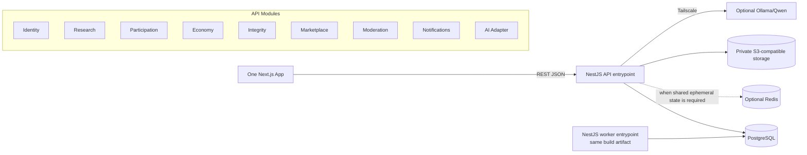
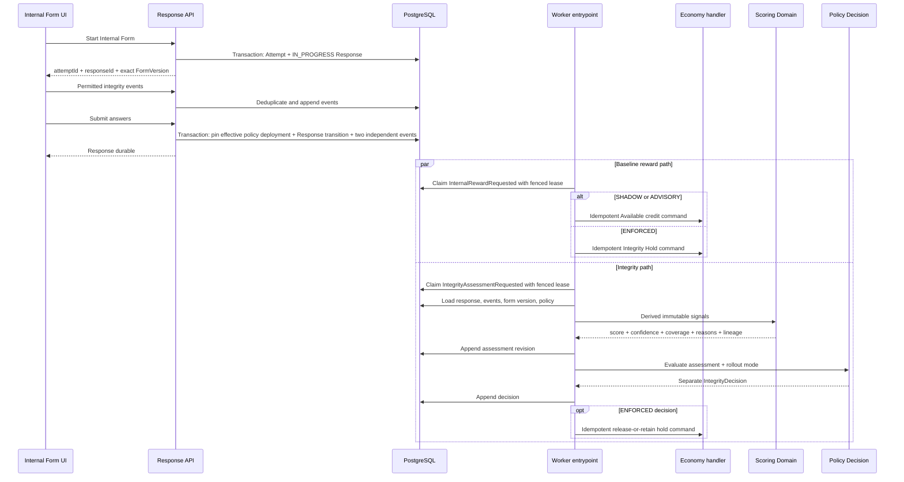

# RESCOM Solution Design and Developer Guide

## 1. Purpose

RESCOM is a pragmatic modular-monolith web platform with one initial Next.js application, one planned NestJS backend codebase, PostgreSQL, conditional Redis, private object storage, and an optional private AI Adapter. The backend produces one build artifact and runs API and worker entrypoints in production. This guide explains how the approved architecture decisions shape implementation, especially the load-bearing FormVersion, Session, Ledger, Outbox, and Internal Form Integrity seams.

The binding contract is `ARCHITECTURE-SPINE.md`. This guide explains that contract; it does not override AD decisions.

Authority is: SPEC → final PRD plus approved Addendum → Spine → this Solution Design → epics → code reality as brownfield evidence. Both `RESCOM Architecture V2 — Research Integrity Engine` copies are superseded, non-canonical historical proposals. Their schema examples and conflicting External assessment, FraudLog, or deployment statements are not implementation inputs.

## 2. System View



The backend remains one codebase and modular monolith. Production runs API and worker as two processes from the same image; local/small deployments may explicitly co-locate them. Modules own their business rules and communicate through application ports or versioned commands/events. They do not reach into another module's tables through ad hoc Prisma calls.

The initial Next.js application uses route groups such as `(public)`, `(auth)`, `(app)`, and `(admin)` to organize public, authentication, authenticated product, and administrative surfaces. Route groups are layout/code organization only; the API must enforce session, capability, row, and administrative authorization independently.

### Identity and Session Boundary

- Access is a signed JWT with a maximum 15-minute TTL in a host-only `Secure` (except explicit local development), `HttpOnly`, `SameSite=Lax`, `Path=/` cookie.
- The token carries `sub`, `sessionId`, and `sessionVersion`; PostgreSQL Session state is authoritative and Redis may only cache it.
- A random refresh secret is stored hashed, rotated on every use, and family-revoked on reuse; its cookie is host-only and scoped to the refresh endpoint. Absolute session lifetime is at most 30 days.
- A new login atomically revokes the prior active session. Logout, password change/reset, and account lock also revoke affected sessions and expire matching cookies.
- `AuthIdentity` keys OAuth providers by provider subject. Google email matching never auto-links accounts: an existing password user must authenticate that account and explicitly link Google with recent authentication; otherwise the OAuth login is blocked without creating a duplicate User. Link/unlink is audited and cannot remove the final login method.
- Unsafe cookie-authenticated methods require exact credentialed CORS origins, Origin/Fetch-Metadata checks, and a per-session synchronizer token in `X-CSRF-Token`.
- The CSRF token is generated with the Session and stored hashed. A `Cache-Control: no-store` bootstrap accepts either valid access or the valid refresh cookie plus exact Origin/Fetch-Metadata checks, so an expired-access reload can recover without making refresh CSRF-blind. Refresh presents the current token and atomically rotates both refresh secret and CSRF hash, returning the next token only to the allowed origin. Tokens never enter URLs/logs, use constant-time comparison, and rotate/revoke with session replacement, privilege elevation, password change, account lock, and logout.
- OAuth callback contracts use one-time expiring state bound to the browser intent, nonce, PKCE where supported, exact redirect allowlists, and provider-token verification for signature, issuer, audience, expiry, subject, and verified email.
- Publisher and Respondent are simultaneous product capabilities. `ADMIN` is privileged authorization, not a mutually exclusive marketplace persona.

## 3. Form and Response Foundations

`Form Definition JSON` remains the canonical survey structure shared by:

- Form Builder
- Form Renderer
- Backend validation
- AI Form Generator
- Integrity metadata validation

`Form` is the stable logical survey aggregate. `FormVersion` is a separate entity with `unique(formId, versionNumber)`. Published versions, their Form Definition, and Integrity configuration are immutable; edits create a new draft version.

Every Attempt pins exactly one FormVersion by foreign key. Starting either Internal or External participation transactionally validates published/open state, targeting eligibility, logical-Form non-completion, quota, and no conflicting active Attempt, then creates the Attempt, expiring quota reservation, and server-authoritative start time. Internal start also creates exactly one one-to-one `IN_PROGRESS` Response identity before telemetry is accepted. Submission transitions that same Response; it never creates a second one. Response answers and authoritative participant/version context come from the Attempt; duplicated identity/version keys are removed or constrained to agree. One completion per authenticated account is enforced under concurrency at the logical Form level. Guest Internal participation uses an explicit guest participant kind, earns no account-bound reward/event, and cannot update Respondent Reliability.

Each published External FormVersion has one server-generated six-digit Completion Code. Its plaintext is shown once to the owning Publisher for embedding; persistence keeps `keyVersion` plus a keyed digest bound to FormVersion. A verifier key remains available while any version using it is active; key retirement or code rotation publishes a new FormVersion/code. A claim validates the active Attempt, exact FormVersion, verifier, server start time, and durable abuse state. Three failed validations lock that Attempt; account-plus-FormVersion limits apply, while IP/device scope requires Privacy approval. A distinct code is not generated for every Respondent attempt because a static external form cannot embed per-attempt values.

The Internal Form Renderer and backend share two contract packages:

The existing target package path is `packages/schemas`, with versioned exports for Form Definition, API envelopes, and Integrity contracts. `packages/types` contains inferred/generated public types only; it must not duplicate schema definitions. npm workspaces come first, and Turborepo remains deferred until measured build-orchestration value exists.

### Double-Entry Economy

Each Point movement is one immutable `LedgerJournal` keyed by a unique business command. It posts at least two `LedgerEntry` rows against explicit `LedgerAccount` records in one PostgreSQL transaction. The signed sum for each journal and unit must equal zero before posting. Account classes define normal balance and overdraft policy: user Available, Pending, Frozen, Escrow, and Integrity Hold accounts cannot become negative; only configured issuance/sink/clearing accounts may carry the opposite balance. Posting locks all affected balance projection rows in ascending account-ID order, checks sufficiency, appends journal/entries, and updates the rebuildable projection in one transaction. Posted records cannot be updated/deleted by runtime roles. A correction journal has a unique `reversesJournalId` and exactly negates the original entries, so each journal can be reversed at most once. If a reversal itself must be corrected, it may be the original of one later linked reversal, producing a non-branching chain; corrected business intent uses another journal. Entries remain the financial authority.

## 4. Integrity Applicability

| Response type | Response Integrity | Respondent Reliability | Survey Quality contribution |
|---|---|---|---|
| Authenticated Internal | Applicable | Applicable when eligible | Applicable |
| Guest Internal | Applicable | `NOT_AVAILABLE` | Applicable |
| External | `NOT_ASSESSED` | No update | No full-engine contribution |

Never represent non-applicability, missing evidence, or insufficient evidence as zero.

## 5. Internal Response Lifecycle



The submission pins the effective policy-deployment identity/mode into both event contracts, so later promotion cannot change that Response's reward path. Response durability never depends on scoring availability. In `SHADOW` and `ADVISORY`, the baseline Available credit also never waits for scoring; only an approved `ENFORCED` policy may start with an Integrity Hold. Guest submissions omit `InternalRewardRequested`. If Integrity processing fails, the assessment remains pending and its path retries independently. A terminal failure or missed governance deadline in `ENFORCED` emits one fail-open release command plus an incident so the hold cannot be stranded. Claims, next retry, attempt count/backoff, last error, and terminal/dead-letter state live in PostgreSQL. For database-local handlers, the domain effect and unique processing/version record commit together. Before external calls, the adapter persists an attempt, reuses the event idempotency key, reconciles provider status on retry, and refuses irreversible providers without idempotency or status lookup.

### Outbox Event Minimum Contract

```text
eventId / idempotencyKey
type + schemaVersion + producer
aggregateType + aggregateId + aggregateVersion
orderingStream + streamSequence (when ordering-sensitive)
correlationId + causationId
payload + availableAt
claimOwner + claimFencingToken + claimExpiresAt
attemptCount + lastError + terminalState
```

Response transition and all required submission events commit in the same transaction. Completion or lease-state updates require the matching owner and fencing token, so a stale worker cannot acknowledge. An ordering-sensitive producer assigns a named ordering stream and contiguous sequence. Its handler consumes the complete stream (recording intentional no-ops), advances sequence monotonically, ignores duplicate/stale sequence, and waits/retries gaps. A dead-letter remains a blocking gap until an audited re-drive or approved skip; money/access/Integrity-policy skips require a compensating or fail-safe command. Aggregate version remains domain concurrency metadata, not a delivery offset for partial subscriptions. PostgreSQL is the only durable work-claim authority; Redis locks cannot compete with it.

## 6. Integrity Event Rules

Permitted event categories include:

- question displayed
- answer committed
- answer changed
- section or question navigation
- focus state changed
- validation error
- response submitted

Prohibited collection includes raw keystrokes, clipboard contents, unrelated browsing activity, and background device activity.

Each event carries:

- unique client event ID
- Attempt and Response ID
- Form Version ID
- consent purpose and notice version
- event type and schema version
- client occurrence timestamp
- server receipt timestamp
- sequence number when available
- allowlisted, size-bounded event payload

Raw answer content belongs to Participation and is not duplicated into telemetry. Ledger, reward, assessment, policy, and review facts use separate domain events/records; `IntegrityEvent` is not a general event bus. Server receipt time is authoritative. Client time is contextual evidence only. Events are immutable during the approved retention period and may be removed/anonymized only through the approved lifecycle.

## 7. Signal Derivation and Scoring

Signal derivation converts events, answers, Form Version context, and eligible history into versioned inputs. Candidate signal groups are temporal, interaction, attention, consistency, semantic, historical, survey-context, and graph evidence.

The scoring core is a pure Domain service:

```text
Assessment = score(
  immutableSignals,
  immutablePolicyVersion,
  applicabilityContext
)
```

Output contract:

```text
score
assessmentConfidence
evidenceCoverage
reasonCodes
policyVersion
assessmentRevision
inputLineageChecksum
assessedAt
```

The scoring core does not import NestJS, Prisma, Redis, HTTP clients, or AI providers. Reprocessing appends a new assessment revision; it never overwrites history. A separate policy evaluator appends an `IntegrityDecision` with policy mode and operational result. Assessment evidence and operational action are never one mutable record.

## 8. Three Independent Dimensions

### Response Integrity

Evaluates one Internal Form response from current-response evidence plus eligible context.

### Respondent Reliability

Uses eligible authenticated Internal Form assessments and confirmed review outcomes. New Respondents begin `UNESTABLISHED`. Completion count and engagement tier remain separate.

### Survey Quality

Evaluates one immutable Form Version from aggregate evidence such as dropout, timing accuracy, question friction, technical failures, feedback, and integrity distributions. A new Form Version starts a new quality history.

Rules:

- Poor Survey Quality cannot automatically reduce Respondent Reliability.
- Respondent history cannot silently override strong current-response evidence.
- Missing history lowers confidence, not score.
- Insufficient Survey Quality sample size returns `INSUFFICIENT_EVIDENCE`.

## 9. Policy Deployment

```text
SHADOW -> ADVISORY -> ENFORCED
```

- `SHADOW`: assessment and separate decision are stored but have no reward or visibility effect.
- `ADVISORY`: authorized users see findings; existing rewards remain unchanged.
- `ENFORCED`: an audited policy may route a response to `ACCEPT` or `REVIEW`.
- `REVIEW`: creates an idempotent integrity hold; it does not declare fraud.

Every new policy version begins in `SHADOW`. Promotion appends an audited promotion record; it does not mutate the policy definition. Promotion requires the named owner and governance evidence defined by Product before launch.

## 10. Integrity Review and Fraud Separation

Integrity Review is a separate Admin workflow from FraudLog.

Reviewers may resolve an assessment as:

- accepted
- insufficient evidence
- rejected with documented reason

Review outcomes append calibration labels and trigger idempotent Ledger actions. They do not mutate historical assessments.

FraudLog records hard security-policy violations or confirmed abuse evidence. A low score, missing evidence, or review route cannot automatically create a FraudLog entry.

## 11. TrustGraph-Ready Data

PostgreSQL remains authoritative for core relationships:

```text
Respondent -> Response -> Form Version -> Publisher
Assessment -> Policy Version
Review -> Assessment -> Outcome
```

TrustEdge is not part of the foundation build. It may be introduced only after these authoritative relations are stable and a measured query/evidence trigger is approved. Any derived edges are restricted, typed, versioned, lineage-bearing, and rebuildable; they never become a second source of truth.

Do not introduce a graph database until measured PostgreSQL query patterns or scale demonstrate a need.

## 12. Module Ownership

| Context | Owns | Must not own/write |
|---|---|---|
| `identity` | User, AuthIdentity, Session/session generation, authorization, DemographicProfile, auth audit | Forms, Attempts, Ledger |
| `research` | Form, immutable FormVersion, definition, targeting/publication metadata | Attempts, Responses, Point records |
| `participation` | SurveyAttempt, Response, answers/submission, completion claim | Scoring policy or Ledger rows |
| `economy` | LedgerAccount, LedgerJournal, LedgerEntry, escrow/hold/settlement, Wallet projection | Integrity scoring/decisions |
| `integrity` | Consent, behavioral events, signals, policies/promotions, assessment revisions, decisions, Reliability/Quality snapshots, IntegrityReview, optional TrustEdge | Response answers, FraudLog, Ledger rows |
| `marketplace` | Eligibility/ranking configuration and rebuildable feed projections | Source profile/Form/Response state |
| `moderation` | Survey moderation, External disputes, FraudLog, admin audit | Integrity assessment/review records |
| `notifications` | Notification intent, delivery attempts/status, read state | Source domain transactions |
| `ai` adapter | Operational provider request metadata only | Accepted Form draft, assessment, or policy authority |
| platform infrastructure | OutboxEvent lease/retry/dead-letter, ProcessedHandler deduplication, technical StoredObject metadata/state | Domain payload meaning, business side effects, or domain attachment relation |

Signals, scoring, Reliability, Quality, review, and optional trust projection are internal Integrity components initially. They are not top-level deployable services. Cross-context state changes use an owner-provided application port or versioned command/event. A context cannot import another context's Prisma repository or write its tables/migrations.

Audit evidence follows the same ownership rule: Identity owns authentication/session/authorization audit, Moderation owns administrative and security-case audit, Economy's immutable journals provide financial command audit, and Integrity owns restricted-evidence access, policy-promotion, decision, and review audit.

### Cross-Context Money Orchestration

The Spine workflow map is binding. Publish+Escrow, External completion+Pending credit, External dispute+hold, and Form close+refund use named Research/Participation/Moderation coordinators with owner-provided Economy commands under one shared PostgreSQL Unit of Work, so paired state commits or rolls back. Internal submission instead commits Response plus independent reward/assessment Outbox events; stable IDs make Economy and Integrity replay-safe. ENFORCED assessment terminal failure releases its hold fail-open and opens an incident. Manual top-up is coordinated by Economy with the actor/correlation in the financial transaction and a replayable Moderation audit event. No workflow performs uncoordinated dual writes.

## 13. Minimum Durable Contract Families

- Identity Session and revocation generation
- Logical Form plus immutable FormVersion
- SurveyAttempt, Response, and logical-Form completion claim
- LedgerAccount, LedgerJournal, LedgerEntry, and Wallet projection
- Integrity Consent, Event, Signal, Policy/Promotion, Assessment revision, separate Decision, Reliability/Quality snapshots, and Integrity Review
- Separate security FraudLog and admin audit
- Leaseable OutboxEvent plus processed-handler deduplication
- Optional TrustEdge projection only after its trigger

Detailed fields are designed in the next Prisma schema task, but they must preserve the Spine invariants and ownership map before a migration is created.

## 14. Failure and Recovery

- Duplicate event: deduplicate by Response ID and client event ID.
- Missing telemetry: submit response; lower evidence coverage or remain pending.
- Worker restart: reclaim expired PostgreSQL leases with a new fencing token without changing event identity; the stale claimant cannot complete.
- Stream ordering: ordering-sensitive handlers consume their complete named stream; duplicate/stale stream sequences are no-op, gaps remain available for later retry, and database-local effect plus processed marker commit atomically. Aggregate version is not treated as a partial-subscription delivery offset.
- Scoring failure: retain response and mark assessment retryable.
- Reward independence: in `SHADOW`/`ADVISORY`, retry or outage in scoring cannot delay or reverse the baseline Available credit path.
- Duplicate scoring request: reuse idempotency key or append only an explicitly requested revision.
- Ledger retry: one business command ID resolves to one journal; duplicate commands return the existing result.
- Redis profile: `REDIS_DISABLED_SINGLE_REPLICA` uses PostgreSQL durable abuse state plus conservative local request limits and refuses multi-replica startup. `REDIS_SHARED` uses Redis counters; if configured Redis is down, sessions/cache fall back to PostgreSQL, guest submission and completion-code mutation fail closed, and low-risk reads may use a conservative local limit plus alert.
- AI outage: Integrity Engine and all core platform flows continue; AI remains optional.

Every scheduled and outbox processor claims durable work through PostgreSQL only and remains safe under retries, lease expiry, and concurrent workers. Scheduled financial/security jobs inherit AD-10 owner/fencing lease, availability, retry/backoff, terminal/dead-letter, audited re-drive/skip, and idempotent-command semantics. Redis may coordinate disposable state but cannot own durable work.

## 15. Environment and Evidence Isolation

Development, staging, and production use separate:

- PostgreSQL databases
- Redis instances or namespaces when Redis is configured
- secrets and credentials
- object-storage boundaries
- AI Gateway credentials

Production integrity events and restricted evidence must not be copied into development or staging unless an approved anonymization process removes direct and linkable identifiers.

Raw events and restricted signals remain behind one audited Integrity query boundary. Publisher, Respondent, and Moderation APIs read audience-specific safe projections with row authorization only.

No production personal-data processing launches until Product plus qualified Privacy/Legal review approves the processing register, purpose/legal basis and notices, data classes/minimization, retention/deletion/anonymization, rights and withdrawal flows, access audit, processor/region inventory, minor-user posture, and incident/legal-hold handling. Integrity telemetry remains under the additional feature gate for consent-purpose/notice version, event field allowlists, policy-promotion owner, review/appeal owner, and Survey Quality minimum evidence. These are launch gates, not claims that legal compliance already exists.

Private object storage is isolated per environment. Platform Infrastructure owns technical StoredObject metadata and `INITIATED → UPLOADED → QUARANTINED → CLEAN → ATTACHED`, with terminal `REJECTED`, `EXPIRED`, and `DELETED`; the domain owner owns only the attachment relation. Uploads use backend-authorized initiation/finalization, short-lived scoped URLs, allowlisted size/type plus server signature verification, and approved scanning. Scan outage stays quarantined and fails closed; only clean objects attach/download. Operations owns provider, scanning, quarantine/release, outage and cleanup; the record-owning context plus Privacy owns classification, access, retention, and deletion.

## 16. Operations and Observability

Monitor:

- event ingestion, deduplication, missing, and ordering rates
- assessment latency, backlog, retries, and failures
- score, confidence, coverage, and policy distributions
- review and overturn rates
- cold-start outcomes and cohort disparity
- Survey Quality distributions
- Ledger hold/release failures
- restricted-evidence access attempts
- outbox lease expiry, retry, dead-letter, and handler-deduplication rates
- session revocation/refresh reuse and CSRF/origin failures
- backup/restore test and migration status

Raw event streams must not be loaded into dashboards. Publisher and Respondent views use precomputed assessment and summary records.

Before production, Operations must approve deploy/rollback and forward-fix policy, secret injection/rotation, health/readiness, structured logs/correlation, alerts and incident ownership, encrypted backups, restore-drill cadence, RPO/RTO, and storage/provider failure handling. A named Platform Migration Integrator owns the repository-wide dependency graph, serial order, cross-context FK review, empty/previous-snapshot integration runs, and apply-once release gate; contexts still author only their tables, and the referencing-table owner authors any cross-context FK. Until then, production readiness is not evidenced.

## 17. Current Code Reality

Observed on 2026-08-16:

- Frontend scaffold: Next.js 16.3.0, React 19.2.8.
- Backend data scaffold: Prisma CLI/Client 6.0.0 with incompatible `@prisma/config` 7.9.1.
- Backend framework: not installed; NestJS remains the adopted target.
- Local database: PostgreSQL 15 Alpine in Docker Compose.
- Root workspace, migrations, CI, Redis, object storage, API, and worker: not implemented.
- Current Prisma schema: syntactically valid and non-conforming; no migration history is present in the repository, and live database state is not evidenced.

Node.js 22 LTS is the selected runtime baseline. Package manifests, lockfiles, CI, and deployment images own exact implementation versions. Before schema generation or backend scaffolding, align Prisma CLI/client/config to one compatible release family and use that major's public `prisma/config` contract. Configure npm workspaces around the existing paths; Turborepo is not a prerequisite.

## 18. Recommended Build Sequence

1. Reconcile authority and approve architecture/schema contracts; do not ratify the current Prisma draft through `db push` or migration.
2. Establish Node 22, one Prisma family, npm workspaces, shared Zod contracts, migrations/test database/CI, and the authentication/security baseline.
3. Implement Identity plus Research (`Form`/`FormVersion`) plus Participation (`Attempt`/`Response`).
4. Implement balanced double-entry Economy.
5. Implement Response submission plus transactional Outbox plus the worker entrypoint from the same backend artifact.
6. Implement External Form completion with explicit Integrity applicability `NOT_ASSESSED`.
7. Add approved consent and Internal Form telemetry only after privacy launch gates pass.
8. Add deterministic Integrity scoring in `SHADOW`, with assessment and operational decision stored separately.
9. Add Respondent Reliability and Survey Quality only after eligible-evidence thresholds and review governance are approved.
10. Add TrustEdge projection, Redis scale-out, frontend/process splits, or other scale infrastructure only after their measured triggers.

## 19. Open Gates

- Product plus qualified Privacy/Legal review: purpose/register, notice version, data classification, retention/deletion/anonymization, subject rights/withdrawal, minor-user posture, processors/regions, and incident/legal-hold rules before any production personal-data processing; telemetry has the additional AD-21 gate.
- Product plus Integrity Governance: promotion owner, calibration/cohort evidence, rollback and audit criteria before leaving `SHADOW`.
- Product plus Research: Survey Quality eligible-response threshold, aggregation/linkability, and export fields before Publisher visibility.
- Operations/Admin: Integrity review and appeal owner, access policy, and turnaround expectations before `ADVISORY` or review routing.
- Operations: confirm the PRD targets of Vercel plus Cloudflare/VPS, select managed PostgreSQL (Neon or Supabase), object-storage/email providers and regions, and approve deploy/rollback, secrets, backup retention, restore cadence, RPO/RTO, alerting, and incident ownership before production readiness.
- Engineering: one Prisma major family and passing schema-contract/concurrency/replay reviews before client generation or the first migration.
- Operations plus record owner/Privacy: storage provider, scanning/quarantine/release/outage/cleanup, classification, retention, and deletion before production file upload.
- Product/Security/Privacy: approved Guest Internal abuse-control artifact before enabling Guest in a shared or production environment.
- Product/Research/Moderation + Engineering: explicit Form publication/moderation state-transition contract and tests before schema/client generation.
