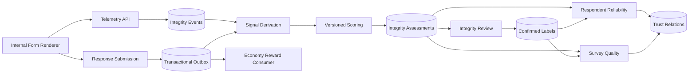

# Research Integrity Engine Technical Handoff

This addendum preserves approved implementation-oriented context that belongs in downstream architecture, UX, data design, and epic planning rather than the main PRD.

## 1. Approved Boundary

- Full Research Integrity Engine applies only to Internal Forms executed inside RESCOM.
- External Forms retain Completion Code, Time Barrier, Pending Balance, Publisher dispute, and FraudLog controls.
- Authenticated Internal responses may use Response Integrity, Respondent Reliability, and Survey Quality.
- Guest Internal participation is disabled until the Product/Security/Privacy/Research gate approves participant identity and repeat-abuse rules. If enabled, Guest responses may use Response Integrity and contribute to Survey Quality; Respondent Reliability is `NOT_AVAILABLE`.
- External responses are `NOT_ASSESSED` by the full engine.
- Missing evidence never becomes a zero score.

## 2. Candidate Runtime Flow



Authenticated Internal submission must atomically persist the submitted Response transition, pinned policy deployment, uniquely identified reward-request outbox event, and uniquely identified assessment-request outbox event. If the Guest gate is later approved, Guest submission emits only the assessment request. Reward and assessment consumers run independently; each request declares its own complete ordering stream/sequence when ordering matters, and replay must be idempotent. Engine failure creates a recoverable pending assessment rather than response loss or delayed `SHADOW`/`ADVISORY` reward.

## 3. Candidate Architecture Decisions

### Internal-Form Integrity Boundary

External evidence absence must not produce low scores. Applicability should be represented explicitly.

### Durable, Idempotent Telemetry

- Event IDs support server-side deduplication.
- Client timestamps are contextual; server receipt time is authoritative.
- Events are linked to Response and immutable Form Version.
- Missing events do not block durable submission.

### Pure, Versioned Scoring Core

- Deterministic scoring should be a framework-independent domain service.
- Inputs are immutable derived signals and an immutable policy version.
- Assessment outputs are score, confidence, evidence coverage, reason codes, and lineage.
- Operational outcome and rollout mode are persisted as a separate immutable Integrity Decision linked to the assessment.
- Reprocessing creates a new assessment revision.

### Independent Dimensions

- Response Integrity, Respondent Reliability, and Survey Quality evolve independently.
- Poor Survey Quality cannot automatically reduce Respondent Reliability.
- Historical reliability cannot silently override strong current-response evidence.
- Confidence remains separate from score.

### Integrity Is Not Fraud

- FraudLog is reserved for security-policy violations and confirmed abuse evidence.
- Integrity reason codes are assessment evidence, not accusations.
- Low scores and review routing cannot automatically create FraudLog records.

### Progressive Enforcement

- New policies begin in `SHADOW`.
- Authenticated Internal submission emits reward and assessment work independently so scoring cannot delay the normal reward path.
- `SHADOW` and `ADVISORY` credit Available without waiting for scoring; `ADVISORY` exposes authorized findings without automatic enforcement.
- `ENFORCED` posts every authenticated Internal reward to a non-spendable Integrity Hold before the Integrity Decision.
- `ACCEPT` releases the pre-existing hold to Available; `REVIEW` retains that hold for human review without declaring fraud.
- Terminal assessment failure or expiry of the governance-approved decision deadline releases the hold under the fail-open rule and opens an operational incident.
- Guest Internal submission never creates an account-bound reward or hold.
- Decision settlement, fail-open settlement, and review settlement compete through one atomically fenced reward-settlement state keyed by Response. Exactly one valid transition moves the held reward; after fail-open release, a late Decision remains audit/calibration evidence and cannot recreate a hold or claw back Available Points through the Integrity path.
- Automatic rejection requires separate authorization and audit.

### Relational TrustGraph First

- PostgreSQL is sufficient for initial typed, versioned relationships.
- Existing foreign-key relationships remain authoritative.
- Derived TrustGraph edges should be rebuildable projections.
- A graph database requires measured justification.

## 4. Candidate Integrity Components

These are internal components of one Integrity bounded context for the initial modular monolith. They are not separate deployable services and need not each become a separate NestJS module until ownership or complexity evidence justifies a split.

```text
integrity-events
integrity-signals
integrity-scoring
respondent-reliability
survey-quality
integrity-review
trust-relations
```

Modules should follow the selected backend architecture's dependency rules. The scoring domain should not import web framework, ORM, cache, or transport dependencies.

## 5. Candidate Data Entities

### IntegrityConsent

- responseId
- noticeVersion
- purposesAccepted
- acceptedAt

### IntegrityEvent

- responseId
- formVersionId
- clientEventId
- eventType
- sequenceNumber
- occurredAt
- receivedAt
- payloadJson

### IntegritySignal

- responseId
- signalDefinitionVersion
- signalType
- valueJson
- evidenceAvailable
- derivedAt

### IntegrityPolicy

- version
- mode
- definitionJson
- checksum
- activatedAt
- retiredAt

### ResponseIntegrityAssessment

- responseId
- policyVersion
- assessmentRevision
- applicability
- status
- score (only when applicable and scored)
- confidence (only when supported by evidence)
- evidenceCoverage (only when applicable)
- reasonCodes (safe, status-appropriate)
- assessedAt

### IntegrityDecision

- assessmentId
- policyVersion
- policyMode
- decision
- commandId
- decidedAt

### RespondentReliabilitySnapshot

- respondentId
- policyVersion
- applicability
- status
- reliabilityState
- score (only when evidence is sufficient)
- confidence
- eligibleResponseCount
- evidenceWindow
- createdAt

### SurveyQualitySnapshot

- formVersionId
- policyVersion
- applicability
- status
- score (only when evidence is sufficient)
- confidence
- eligibleResponseCount
- reasonCodes
- createdAt

### IntegrityReview

- assessmentId
- reviewerId
- status
- outcome
- reason
- rewardAction
- openedAt
- deadlineAt (required before `ENFORCED` activation)
- reviewedAt

### TrustEdge Projection

- sourceType
- sourceId
- targetType
- targetId
- relationType
- evidenceVersion
- confidence
- createdAt

TrustEdge is a rebuildable projection for derived relationships. It does not replace authoritative domain foreign keys.

## 6. Candidate Enums

```text
IntegrityApplicability:
  APPLICABLE
  NOT_ASSESSED
  NOT_AVAILABLE

IntegrityAssessmentStatus:
  PENDING
  COMPLETED
  INSUFFICIENT_EVIDENCE
  FAILED_RETRYABLE
  FAILED_TERMINAL

IntegrityDecision:
  ACCEPT
  REVIEW
  NOT_ASSESSED

IntegrityPolicyMode:
  SHADOW
  ADVISORY
  ENFORCED

ReliabilityState:
  UNESTABLISHED
  EMERGING
  ESTABLISHED
  TRUSTED

ReviewOutcome:
  ACCEPTED
  INSUFFICIENT_EVIDENCE
  REJECTED

IntegrityReviewStatus:
  OPEN
  RESOLVED
```

Engagement tier remains independent of `ReliabilityState`.

## 7. Candidate Data Integrity Rules

- Unique `(responseId, clientEventId)` prevents duplicate telemetry.
- Unique `(responseId, policyVersion, assessmentRevision)` prevents assessment duplication.
- Active policy definitions are immutable.
- Historical reliability and Survey Quality snapshots are append-only.
- Form Version is mandatory for eligible events, signals, and Survey Quality snapshots.
- Guest responses cannot create Respondent Reliability snapshots.
- `NOT_ASSESSED`, `NOT_AVAILABLE`, `PENDING`, and `INSUFFICIENT_EVIDENCE` never fabricate zero scores; score-bearing fields are conditional on an applicable completed assessment.
- Assessment processing state is separate from Integrity Decision and Integrity Review lifecycle state.
- Raw telemetry cannot be returned by Publisher APIs.
- Event partitioning should be introduced only after measured volume requires it.

## 8. Candidate APIs

```text
POST /responses/:responseId/integrity-events
POST /responses/:responseId/submit

GET  /publisher/forms/:formId/integrity-summary
GET  /publisher/responses/:responseId/integrity
GET  /publisher/forms/:formId/survey-quality

GET  /me/reliability-summary
GET  /admin/integrity-reviews
GET  /admin/integrity-reviews/:reviewId
POST /admin/integrity-reviews/:reviewId/resolve
```

Publishers receive safe assessments, confidence, evidence coverage, reason codes, and review status. They never receive raw telemetry, sensitive device links, hidden thresholds, or unrelated Respondent history.

## 9. Candidate UX Surfaces

- Form Builder Integrity Settings and validation warnings.
- Telemetry notice and purpose disclosure.
- Respondent submission, pending, review, and appeal states.
- Respondent reliability state and confidence, separate from engagement tier.
- Publisher Response Integrity distribution and Survey Quality findings.
- Admin integrity-review queue separate from FraudLog.
- Explicit External `NOT_ASSESSED` messaging.
- Neutral, accessible language that avoids public integrity rankings.

## 10. Rollout and Verification

### Rollout

1. Instrumentation validation.
2. Shadow scoring.
3. Calibration against reviewed samples.
4. Advisory dashboards.
5. Authorized enforced review routing.
6. Advanced models only after sufficient confirmed labels exist.

### Tests

- Signal and scoring-rule unit tests.
- Deterministic golden cases.
- Event and API contract tests.
- Idempotency and replay tests.
- Cold-start and applicability tests.
- Permission and privacy tests.
- Failure and recovery tests.
- Cohort and fairness reports.
- Review and appeal tests.

### Monitoring

- Event deduplication, missing, and ordering rates.
- Assessment latency, pending backlog, retries, and failures.
- Score, confidence, evidence coverage, and policy distributions.
- Review and overturn rates.
- Cold-start outcomes and cohort disparity.
- Survey Quality distributions.
- Ledger hold/release failures.
- Restricted-evidence access attempts.

## 11. Architecture Update Reconciliation

The 2026-08-16 Architecture Update resolves the earlier handoff conflicts as follows:

1. NestJS is the adopted backend target; Express references are historical implementation notes.
2. Registration grants 100 Frozen Points. The prior 500-Point discrepancy was stale and is not present in the current Story 6.5.
3. Unlock requires both the demographic survey and one Marketplace survey; expiry is 30 days, matching the final PRD.
4. Redis is optional ephemeral infrastructure, introduced for multi-replica or measured shared-state needs. PostgreSQL remains authoritative for Attempts, sessions/revocation, Outbox, Ledger, and durable workflows.
5. Production uses API and worker entrypoints from one NestJS codebase/image; explicit local co-location is permitted. This is not a microservice split.
6. `RESCOM Architecture V2 — Research Integrity Engine` is a superseded, non-canonical historical proposal and cannot override the SPEC companion chain.

The current Prisma schema has no migration history in the repository and live database state is not evidenced; it must be redesigned against the updated Spine before client generation or migration work.
