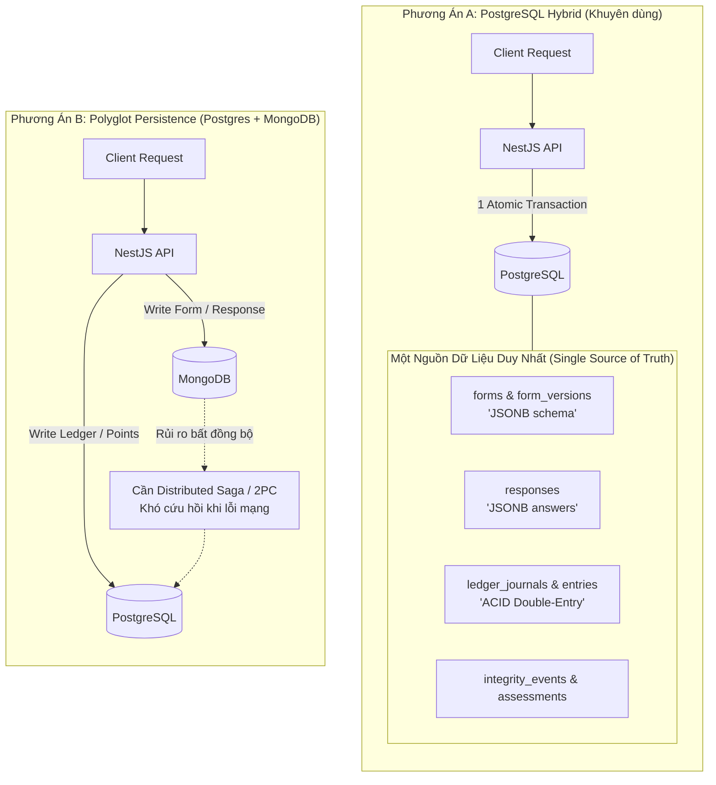

# ADR-004: Chiến Lược Lưu Trữ Dữ Liệu Khảo Sát Động (PostgreSQL JSONB vs. MongoDB)

- **Trạng thái:** Proposed (Đề xuất)
- **Tác giả:** Paige (Technical Writer) & System Architecture Team
- **Ngày lập:** 2026-09-12
- **Dự án:** RESCOM (`project-rescom`)
- **Phạm vi:** `apps/backend`, `packages/schemas`, Database Architecture

---

## 1. Bối Cảnh & Vấn Đề (Context & Problem Statement)

Trong hệ thống RESCOM, các biểu mẫu khảo sát (**Survey Forms**) và câu trả lời (**Responses**) có bản chất là dữ liệu phân cấp, đa hình và biến động cao (dynamic schema):
- Mỗi khảo sát có thể chứa nhiều loại câu hỏi: trắc nghiệm một lựa chọn, trắc nghiệm nhiều lựa chọn, thang đo Likert, câu hỏi mở, tải tệp, hoặc logic rẽ nhánh (conditional branching).
- Cấu trúc câu hỏi không cố định giữa các biểu mẫu khác nhau.
- Câu trả lời của người dùng cũng tương ứng thay đổi theo từng loại câu hỏi.

**Câu hỏi kiến trúc đặt ra:**
> *Có nên đưa MongoDB vào hệ thống song song với PostgreSQL (mô hình Polyglot Persistence) để chuyên trách lưu trữ các form khảo sát và câu trả lời động không? Hay tiếp tục sử dụng mô hình Hybrid Relational + JSONB trên PostgreSQL hiện tại?*

---

## 2. Mô Hình Tư Duy (The Mental Model & Analogy)

> 💡 **Phép so sánh: Két sắt tiền mặt và Bàn nộp hồ sơ**
> 
> Hãy tưởng tượng RESCOM là một văn phòng nghiên cứu có thưởng tiền mặt:
> - **Hồ sơ khảo sát:** Là tờ phiếu khảo sát mà sinh viên điền vào.
> - **Két sắt ngân quỹ:** Là sổ cái kế toán kép (Double-Entry Ledger) chứa điểm thưởng và số dư ký quỹ (Escrow).
> 
> Nếu ta đặt Két sắt ở tòa nhà A (PostgreSQL) và Bàn nộp hồ sơ ở tòa nhà B (MongoDB):
> Mỗi khi sinh viên nộp một tờ phiếu hợp lệ để nhận 50 điểm:
> 1. Tòa nhà B nhận phiếu.
> 2. Phải gọi điện thoại sang tòa nhà A để mở két xuất 50 điểm.
> 3. Nếu đường dây điện thoại bị đứt đúng lúc két vừa mở (network partition / crash), sinh viên nhận được điểm nhưng tòa nhà B chưa kịp lưu phiếu, hoặc ngược lại!
> 
> Đó chính là bài toán **Giao dịch phân tán (Distributed Transactions)**. Ngược lại, nếu cả Bàn hồ sơ lẫn Két sắt nằm trong cùng một tòa nhà (PostgreSQL), thủ quỹ có thể thực hiện một giao dịch duy nhất: *"Đóng dấu nhận phiếu VÀ xuất điểm cùng một tích tắc (ACID transaction)"*.

---

## 3. So Sánh Chi Tiết: PostgreSQL JSONB vs. MongoDB



### Bảng Phân Tích Tiêu Chí Kỹ Thuật

| Tiêu chí | Phương án A: PostgreSQL (Relational + JSONB) | Phương án B: Thêm MongoDB (Polyglot) |
| :--- | :--- | :--- |
| **Tính toàn vẹn giao dịch (ACID Invariants)** | **Tuyệt đối**. Khi nộp bài: Lưu `Response` + Cập nhật Quota + Giữ/Nhả Escrow Point trong **1 giao dịch DB duy nhất**. | **Rủi ro cao**. Không thể dùng transaction nguyên khối giữa 2 DB. Cần cơ chế bù trừ (Saga/Outbox) phức tạp. |
| **Khả năng lưu trữ dữ liệu động** | **Rất tốt**. Kiểu `JSONB` lưu trữ định dạng nhị phân, hỗ trợ truy vấn sâu, path expressions, và GIN index. | **Tự nhiên**. MongoDB thiết kế chuyên cho document-based data. |
| **Quan hệ & Truy vấn chéo (Cross Queries)** | **Rất dễ dàng**. Dễ dàng `JOIN` giữa câu trả lời khảo sát với Profile nhân khẩu học (`DemographicProfile`), Sự cố gian lận (`IntegrityIncident`), hay Điểm uy tín (`RespondentReputation`). | **Phức tạp**. Không hỗ trợ JOIN xuyên database; phải query cả 2 DB rồi ghép dữ liệu bằng code trên RAM của backend (Node.js). |
| **Độ phức tạp hạ tầng & Vận hành** | **Tối giản**. Chỉ duy trì 1 cụm PostgreSQL (Docker Compose ở local; 1 instance Supabase/Neon/RDS ở production). | **Tăng gấp đôi**. Cần cấu hình, giám sát, kết nối pool, và chiến lược backup point-in-time recovery (PITR) cho cả 2 hệ quản trị khác nhau. |
| **ORM & Hệ sinh thái Code** | **Đồng nhất**. Sử dụng toàn bộ qua Prisma ORM hiện có với kiểu định nghĩa TypeScript mạnh. | **Xung đột**. Prisma không hỗ trợ quan hệ đa database (cross-provider relation); cần cài thêm Mongoose hoặc viết raw query. |
| **Chi phí triển khai** | Miễn phí tài nguyên phụ trợ, tận dụng tối đa gói Cloud DB hiện tại. | Tốn thêm chi phí hosting cho MongoDB Atlas + PostgreSQL riêng biệt. |

---

## 4. Tại Sao PostgreSQL JSONB Hoàn Toàn Đáp Ứng Được Dữ Liệu Động?

Nhiều lập trình viên lo ngại PostgreSQL là SQL truyền thống nên lưu dữ liệu động sẽ chậm hoặc gò bó. Tuy nhiên, từ phiên bản PostgreSQL 9.4+ (và hiện tại dự án dùng **PostgreSQL 15**), `JSONB` sở hữu các tính năng vượt trội:

1. **Lưu trữ nhị phân đã phân tích cú pháp (Decomposed Binary Format):**
   - `JSONB` không lưu dạng chuỗi text thô mà biên dịch sẵn thành cây nhị phân, giúp đọc và truy xuất các trường con cực nhanh.
2. **Đánh chỉ mục Inverted Index (GIN Indexing):**
   - Cho phép đánh index thẳng vào bên trong JSON:
   ```sql
   CREATE INDEX idx_form_version_schema ON form_versions USING gin (schema_json);
   CREATE INDEX idx_responses_answers ON responses USING gin (answers_json);
   ```
   - Hỗ trợ các toán tử kiểm tra phần tử con như `@>`, `?`, `?|`, `jsonb_path_query`.
3. **Bất biến theo phiên bản (Immutability by Versioning):**
   - Trong RESCOM, một biểu mẫu khi đã `PUBLISHED` thì schema được đóng băng (`is_published = true` trong `FormVersion`).
   - Mọi `Response` đều liên kết chặt chẽ với đúng `formVersionId`, đảm bảo cấu trúc câu trả lời luôn khớp với định nghĩa form tại thời điểm đó.

---

## 5. Kiến Trúc Khuyến Nghị Triển Khai (Recommended Architecture)

Thay vì bổ sung MongoDB, RESCOM nên áp dụng mô hình **Hybrid Schema Pattern** ngay trên PostgreSQL:

```
                  ┌──────────────────────────────────────────────┐
                  │          Next.js Frontend / API Client        │
                  └──────────────────────┬───────────────────────┘
                                         │ (Request Payload)
                                         ▼
                  ┌──────────────────────────────────────────────┐
                  │    Shared Zod Schemas (packages/schemas)     │
                  │  - FormBlockSchema (text, choice, matrix)    │
                  │  - SurveyAnswerSchema                        │
                  └──────────────────────┬───────────────────────┘
                                         │ Validated Data
                                         ▼
                  ┌──────────────────────────────────────────────┐
                  │             NestJS Backend Core              │
                  │  - FormService / SurveyAttemptService        │
                  │  - LedgerService (Double-Entry Accounting)   │
                  └──────────────────────┬───────────────────────┘
                                         │
                         ┌───────────────┴───────────────┐
                         ▼                               ▼
                 [Relational Columns]             [JSONB Columns]
                 - id (UUID)                      - schema_json (Dynamic Blocks)
                 - publisher_id (UUID)            - targeting_json (Demographics)
                 - reward_per_response (Int)      - answers_json (Key-Value Answers)
                 - status (FormStatus Enum)       - client_context (Telemetry)
                         ▲                               ▲
                         └───────────────┬───────────────┘
                                         │
                  ┌──────────────────────┴───────────────────────┐
                  │          PostgreSQL 15 (Single Source)        │
                  └──────────────────────────────────────────────┘
```

### Các lớp bảo vệ:
1. **Lớp Xác thực (Validation Layer):**
   - Sử dụng thư viện `zod` trong `packages/schemas` để định nghĩa kiểu dữ liệu cho từng loại Form Block và Answer.
   - Dù PostgreSQL lưu `JSONB`, dữ liệu đi qua NestJS luôn được validate 100% chặt chẽ trước khi insert/update.
2. **Lớp Giao dịch (Transactional Integrity):**
   - Khi nộp khảo sát, Prisma thực hiện `$transaction`:
     - Ghi nhận bản ghi `Response` (với `answers_json`).
     - Ghi nhận bản ghi `SurveyAttempt` -> `COMPLETED`.
     - Chuyển điểm ký quỹ sang trạng thái sẵn sàng giải ngân cho Respondent trong `LedgerJournal` / `LedgerEntry`.
     - Tăng số lượt hoàn thành `expected_completions`.

---

## 6. Kết Luận & Quyết Định Đề Xuất (Decision & Recommendation)

1. **Quyết định:** **KHÔNG** đưa MongoDB vào hệ thống ở giai đoạn này.
2. **Giải pháp thực hiện:**
   - Tiếp tục khai thác mô hình **PostgreSQL 15 + JSONB** cho `FormVersion.schema_json` và `Response.answers_json`.
   - Chuẩn hóa các Zod schema trong `packages/schemas/src/forms/` để đảm bảo tính linh hoạt của form builder mà không đánh mất tính an toàn kiểu dữ liệu.
   - Thêm GIN index cho các cột `JSONB` khi phát sinh nhu cầu tìm kiếm, thống kê trực tiếp trên câu trả lời.
3. **Khi nào mới cân nhắc lại MongoDB?**
   - Chỉ khi RESCOM đạt quy mô hàng triệu lượt nộp khảo sát mỗi ngày, tách hẳn hệ thống form thành một Microservice độc lập không cần giao dịch nguyên khối với ví điểm (Point Economy).
